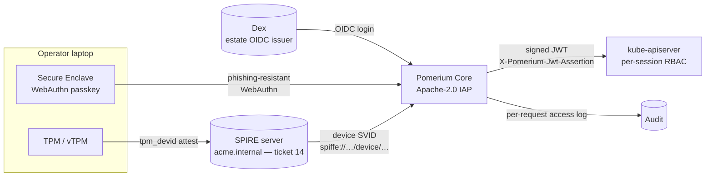

# platform/access — the human + device access plane

**Ticket 18.** Operational access (kubectl / dashboards / break-glass) for the
**human** and **device** actor classes, on the **same attestation root** as
workloads. Pomerium Core (Apache-2.0) is the identity-aware proxy in front of
the KinD kube-apiserver; Dex is the estate OIDC issuer; SPIRE `tpm_devid` issues
the device a SPIFFE ID on the one `acme.internal` root. **Not Teleport** — its
Device Trust *and* OIDC connectors are Enterprise-only.

This is the third projection of the one policy onto identity: "which factors do
you satisfy?" sets what you may do, and the £ of the operation sets the bar.

## What's here

| Piece | File | Role |
|---|---|---|
| Namespace | `namespaces.yaml` | `access` plane |
| Estate OIDC | `oidc/dex-helmrelease.yaml` | Dex — human login issuer; same subject as the gitsign committer |
| IAP | `pomerium/helmrelease.yaml` | Pomerium Core in front of the kube-apiserver: OIDC + WebAuthn + device gate → signed JWT the apiserver trusts |
| Device attestor | `device/spire-tpm-devid-values.yaml` | `tpm_devid` node-attestor overlay for ticket 14's SPIRE server (endorsement + DevID CA verify) |
| Device SVID | `device/device-svid.yaml` | `ClusterStaticEntry` → `spiffe://acme.internal/device/operator-macbook` on the workload root |
| Hardware root | `device/secure-enclave.md` | why the Mac Secure-Enclave key is the live root; UTM vTPM EUDs for `tpm_devid` |
| The gate | `access.py` | graded ALLOW / STEP_UP / DENY by op risk × factors — the decision logic, with asserts |

## The wiring (one root, three actor classes)



The human logs in through **the same OIDC root** the rest of the estate trusts;
the device earns a SPIFFE ID from **the same SPIRE CA** that signs workload
SVIDs. Provenance for every actor is now literal — commit (gitsign→Rekor),
workload (SVID path), human (OIDC subject), device (device SVID) — one root.

## The gate is graded, not admit/deny

`access.py` is the load-bearing logic for the talk's human/device beat. The op's
risk sets the required factors, cumulatively:

| Op tier | Example | Requires |
|---|---|---|
| 1 | `read`, `list` | authenticated human (OIDC) |
| 2 | `write`, `exec` | + phishing-resistant WebAuthn |
| 3 | `break-glass`, `cluster-admin` | + attested device (valid device SVID) |

```bash
access.py decide break-glass --oidc --webauthn --device   # ALLOW
access.py decide break-glass --oidc --webauthn             # DENY  (unattested laptop)
access.py decide write       --oidc --device              # STEP_UP (prompt for passkey)
access.py selfcheck                                        # the asserts
```

A stolen credential (no passkey) gets *stepped up*, not in; an unmanaged laptop
(no device SVID) is *refused* for anything privileged — it cannot be stepped up.

## Run it

```bash
estate/driftwood/scripts/up.sh          # cluster + Flux first
estate/platform/identity/up.sh          # SPIRE/Istio/OpenBao substrate first
estate/platform/access/up.sh            # Dex + Pomerium + device SVID
estate/platform/access/verify-access.sh # offline asserts (+ live if up)
```

`up.sh` drives Dex/Pomerium through Flux's helm-controller, every reconcile
`timeout`-bounded. The `tpm_devid` attestor is a values **overlay** merged into
ticket 14's SPIRE release (kept out of that file to avoid collision) — up.sh
prints the merge + reconcile step. `verify-access.sh` asserts the structural
invariants and the decision logic offline; the live WebAuthn enrolment and TPM
attestation need a human at the Secure Enclave / a (v)TPM (see
`device/secure-enclave.md`) — the one hardware-gated step.

## Calibration knobs (real-world, not constants)

- **Chart/appVersion pins** (`dex` 0.19.1, `pomerium` 52.3.0) — value schemas
  drift across minors; bump to the release you tour and re-run verify.
- **OP_TIER table** (`access.py`) — which op needs which factors. Static now;
  wire to `fair.py`'s £-crossover if the bar should move live with the risk £.
- **DevID trust anchors** — `devid-ca.pem` / `endorsement-ca.pem` are the
  manufacturer roots for a real fleet, the swtpm-emulated EK roots for the UTM
  vTPM demo. Same mechanism; swap the PEMs.
- **WebAuthn attestation conveyance** — `none` (unclonable enclave key, honest)
  vs `direct` + FIDO MDS (manufacturer-attested device). Say which you show.
- **SVID TTLs** — device `x509SVIDTTL: 1h`, `jwtSVIDTTL: 5m`: a retired/stolen
  laptop loses its device identity fast.
