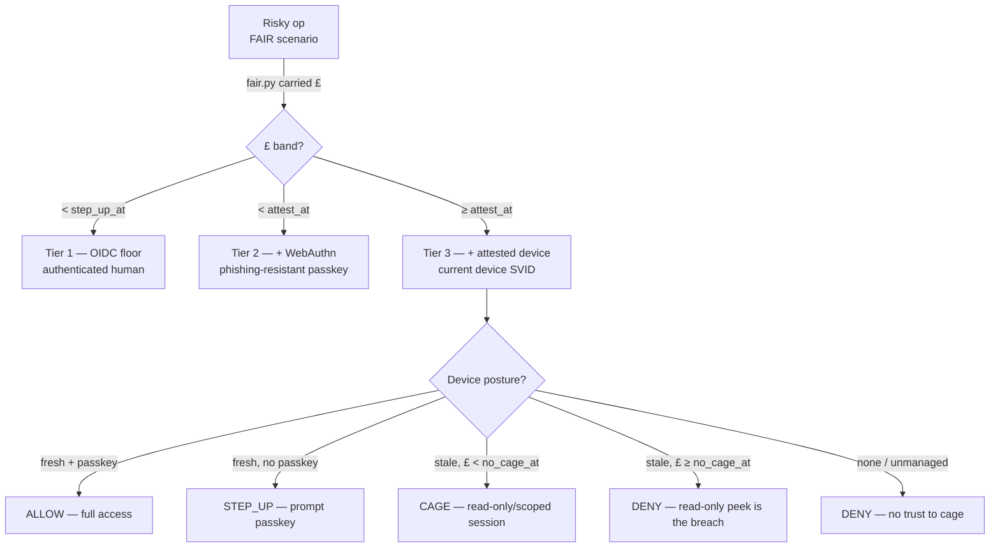

# platform/break-glass — posture-gated human access, priced by £

**Ticket 19** (blocked by 06, 18). A risky operation — break-glass, or a `ludlow`
patient-data read — demands **current device posture** + **higher identity
assurance**, *proportional to the operation's £*. A stale or unattested device is
**caged** (read-only/scoped session) or **denied** — the harder the £, the less a
degraded device gets away with.

This is the human/device projection of the one policy, sharpened. Ticket 18's
`../access/access.py` gates by a static op→tier table and treats the device as
binary present/absent; it flagged both as its upgrade path. This ticket builds
that path:

1. **The bar is the £, not a table.** The op's FAIR scenario runs through
   `../fair/fair.py`; its `carried` £ (TVaR + risk load) picks the assurance band.
   Higher £ ⇒ a strictly stronger required set — the same money `../risk/enforce.py`
   uses to pick Audit vs Deny for workloads.
2. **Device posture has currency.** A device SVID is `fresh` (attested, in
   currency), `stale` (was attested, now aged out — the currency controller,
   ticket 16, has dropped the entry), or `none` (unmanaged laptop, never on the
   `acme.internal` root). Currency, not mere existence, decides the rung.

## What's here

| Piece | File | Role |
|---|---|---|
| The gate | `break-glass.py` | graded DENY / CAGE / STEP_UP / ALLOW by op-£ × device posture — the decision logic, with asserts |
| Assurance bands | `assurance-bands.json` | £ thresholds: `step_up_at` / `attest_at` / `no_cage_at` |
| Scenarios | `scenarios/*.json` | single-state FAIR triples: `driftwood-read` (T1) · `tuppence-write` (T2) · `driftwood-bulk-export` (T3-cage) · `ludlow-patient-data` (T3-deny) |
| Verify | `verify-break-glass.sh` | offline asserts + structural invariants (reuse, band ordering, per-scenario tier) |

No cluster resources of its own — it **rides on the access plane** (ticket 18:
Pomerium Core + Dex OIDC + SPIRE `tpm_devid` device SVID). In a live estate this
engine is the forward-auth / external-authz decision a Pomerium route calls; the
IAP wiring and its live checks live in `../access/`.

## The gradient (proportional to £)



| Op | carried £ | Tier | fresh+passkey | stale device | unmanaged |
|---|---|---|---|---|---|
| `driftwood-read` | ~£1.9k | 1 | ALLOW | ALLOW (irrelevant) | ALLOW |
| `tuppence-write` | ~£53k | 2 | ALLOW | ALLOW (device n/a) | STEP_UP if no passkey |
| `driftwood-bulk-export` | ~£535k | 3 | ALLOW | **CAGE** (read-only) | DENY |
| `ludlow-patient-data` | ~£2.4M | 3 | ALLOW | **DENY** | DENY |

The money-shot: the **same stale device** is *caged* on the £535k export but
*denied* on the £2.4M patient read — the response is proportional to the £, not a
fixed rule.

```bash
break-glass.py decide scenarios/ludlow-patient-data.json  --oidc --webauthn --device fresh   # ALLOW
break-glass.py decide scenarios/ludlow-patient-data.json  --oidc --webauthn --device stale    # DENY
break-glass.py decide scenarios/driftwood-bulk-export.json --oidc --webauthn --device stale    # CAGE
break-glass.py decide scenarios/tuppence-write.json        --oidc --device fresh                # STEP_UP
break-glass.py selfcheck                                                                        # the asserts
```

A stolen credential (no passkey, known human) is *stepped up*; a device out of
currency is *caged or denied by £*; an unmanaged laptop is *refused* — it cannot
be caged into trust it never had.

## Run it

```bash
estate/driftwood/scripts/up.sh          # cluster + Flux
estate/platform/identity/up.sh          # SPIRE / Istio / OpenBao substrate
estate/platform/access/up.sh            # Dex + Pomerium + device SVID (the plane this rides on)
estate/platform/break-glass/verify-break-glass.sh   # offline asserts (no cluster needed)
```

## Calibration knobs (real-world, not constants)

- **`assurance-bands.json`** — `step_up_at` / `attest_at` / `no_cage_at` in £/yr.
  Calibrated against the estate's appetite ordering (`../risk/appetite.json`,
  ludlow strictest). Bump to re-tour; the tier boundaries move with them.
- **Scenario triples** — each op's `(min, mode, max)` loss magnitude is an
  estimate; a reassessment (as in `../risk/` ticket 06) can push an op across a
  band and change its required assurance, in a reviewable PR justified by the £.
- **Posture currency source** — `fresh`/`stale`/`none` is supplied live by the
  currency controller (ticket 16) reading the device SVID's renewal; the shorter
  the SVID TTL (`../access/` sets `1h`/`5m`), the faster a retired laptop goes
  `stale` then `none`.
