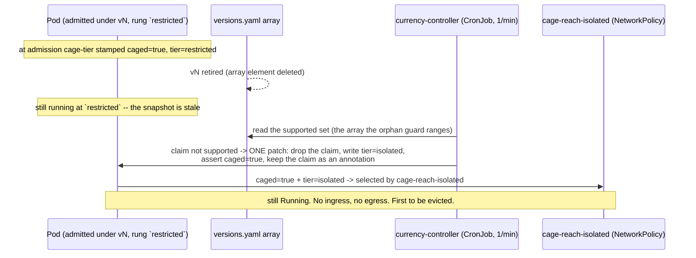

# platform/currency-controller — the estate's only post-admission re-cage

**Owned by `platform`** (`../party.yaml`, `publishes[]` → `implementations` /
`currency-controller`), numbered by the platform's own `v*` tag. Eco-system
ticket 91.

The one sentence it exists to make true, and the one the gate grades:

> a pod admitted under a version that is later retired is re-caged to
> `isolated` on the next controller pass.

## The gap it closes

Admission is a snapshot. `cage-tier` reads the pod's governed Namespace and
stamps a rung; the orphan guard judges the claim against the version array.
Both fire once, at admission, and never again. When the platform later retires a
version from `distribution/versions.yaml`, every pod already running under it
keeps the rung it was admitted with. **Nothing else in the estate re-evaluates
it.** The orphan guard stops the *next* such pod at admission; this catches the
one already running. One source of truth, two enforcers.



## Currency = the claim is still in the array

`supported` is the version set still declared in `distribution/versions.yaml`
(via the `policy-versions` ResourceSet) — the **same array** the orphan guard
allow-lists. A pod is **stale** iff its `policy-as-versioned.dev/policy-version`
claim is no longer in that set.

## Why the patch has the shape it has (the crux, and it is not the old one)

`cage-tier` **clobbers** `posture.acme.io/tier` from the Namespace on every
`CREATE` *and* `UPDATE`, for every pod that claims a version. So writing the tier
alone is undone by the very admission the write triggers. There is exactly one
durable patch, and it does three things in a single JSON merge:

| the write | why it has to be in this patch |
|---|---|
| `policy-as-versioned.dev/policy-version: null` | takes the pod out of scope for `cage-tier` (so the rung below is not clobbered back) and for the orphan guard (so the `UPDATE` is not refused) |
| `posture.acme.io/version: null` | the **unversioned** `posture-trust-boundary` — the copy installed on the demo cluster — **Denies** a posture that does not equal its claim and is not gated on a version, and the line above has just removed the claim. Leave this behind and the whole patch is refused at admission *there*. (Every **served** copy adds `only-this-policy-version`, so for an adopter running only the composed set a claimless pod is out of its scope and there is no Deny; the reason is the unversioned copy, not those.) Dropping it is itself a tightening: the pod stops matching the posture `ClusterSPIFFEID` and falls back to the base-mesh identity, losing posture-gated reach and its OpenBao secret |
| `posture.acme.io/tier: isolated` | the bottom rung. **This is the half the old de-posture patch did not have** |
| `posture.acme.io/caged: "true"` | asserted rather than assumed, because every generated reach policy selects on **caged AND tier** — so `cage-reach-isolated`, deny-all ingress *and* egress, selects the pod |

The claim it removes survives as the annotation
`policy-as-versioned.dev/retired-claim`, so the record of which retired version
admitted the pod is not destroyed. No matchCondition in the estate reads an
annotation, so keeping it costs nothing at admission.

## The precondition, and it is not a detail

Every **served** copy of `cage-netpol` — `distribution/policies/v<declared>/`, and
each adopter's `composed/` — carries an `only-this-policy-version` matchCondition
that the authoring copy in `graded/policies/` does **not**. This patch removes the
claim. So the re-caged pod does not fire that policy and **cannot generate its own
reach cage**: it can only be *selected* by a `cage-reach-isolated` the namespace
**already has**, generated when some pod claiming a currently-served version was
admitted there above `baseline`.

**In a namespace with none, re-caging writes `isolated` as a label and changes
nothing the pod can reach.** That is true of `tuppence-reset` on `kind-driftwood`
today: `kubectl get networkpolicy -n tuppence-reset` returns nothing, and
`tuppence-reset/teller-stale` is the estate's one stale pod. `verify-currency.sh`
derives the precondition from the served bodies, and checks the NetworkPolicy is
present on the cluster **before** it runs a pass — so a namespace without one is a
could-not-look, never a red left behind after a live pod's claim has been
stripped.

Closing it properly is a separate question this module does not own: either the
namespace's own governed tier already puts a claiming pod above `baseline` (which
generates all three rungs), or the reach cages are rendered per governed Namespace
from the composed artefact instead of generated from a pod. The second is the
upgrade path `cage-netpol.yaml`'s own header already names.

**The defect this repairs.** The pre-2026-09-05 module removed the claim and the
identity *posture* label and never touched the tier. Because removing the claim
takes the pod permanently out of `cage-tier`'s scope, that froze the pod at
whatever rung it was admitted with, for the rest of its life: a retired-version
pod sat on at `restricted` and the retirement changed nothing. `verify-currency.sh`
grades that as a property derived from the shipped `cage-netpol` podSelectors,
not as a memory, so it cannot come back quietly.

## Tighten-only

The ladder is `baseline < restricted < quarantine < isolated`
(`../graded/cage.py` `ORDER`; `infra` is a platform role declaration, not a rung
anything moves to). Three independent things hold the property:

1. **structural** — `recage_patch()` takes the retired claim and nothing else.
   It cannot read the pod's current rung, so it cannot echo a looser one back,
   and the only tier it can write is the last element of that ladder.
2. **checked** — `is_tighten()` is applied to every pod before it is patched. A
   pod it would not tighten is *held*, with the reason printed.
3. **RBAC** — `manifests/rbac.yaml` grants `get, list, patch` on pods and
   nothing else. **No `delete`.** `--action evict` is gone: the estate does not
   remove a workload, it cages it and prices the residual (ADR-0022; ticket 75
   Q5). A controller with no delete verb cannot evict even by mistake.

### What it costs — two residual softenings, recorded rather than hidden

Tighten-only holds; these are the price of the patch, and neither was written
down before ticket 91 round 2.

1. **`infra` is overwritten, not moved past.** It is a platform *role
   declaration* on a Namespace (ADR-0022), not a rung on this ladder. A pod
   somehow carrying `tier=infra` reads as unknown here and is overwritten with
   `isolated`. Fail-closed — but an overwrite of a declaration, not a move along
   the ladder.
2. **The re-caged pod's cage is softer against a hand edit.** After the patch the
   pod is outside the scope of `cage-tier`, the orphan guard *and* every served
   `cage-netpol`, so its rung is held by a label no admission will ever re-assert.
   A claiming pod's rung is re-clobbered from its Namespace on every update; this
   one's is not. What still holds it is RBAC: a workload cannot patch its own pod.

`verify-currency.sh` derives the ladder from `cage.py` itself and FAILs if this
module's mirror of it ever drifts.

## A missing instrument re-cages nothing

An array the controller cannot read is **not** an empty array: an empty
`supported` set would make every claiming pod in the estate stale and re-cage the
lot. A 404 on the ResourceSet, an unreadable array, an empty array and an empty
`SUPPORTED_VERSIONS` override each raise `MissingInstrument`; the pass exits
non-zero with the reason named and touches no pod (ADR-0020). Before ticket 91
that GET was unguarded: on a cluster with no flux-operator it 404'd, the pass
crashed every minute, and the module was written off as "it 404s" (ticket 13
item 2) rather than repaired. Eco-system ticket 32 scoped this fix and never
did it.

## What's here

| Piece | File | Role |
|---|---|---|
| Controller | `currency.py` | pure stdlib: `select_stale` + `plan_actions` + `is_tighten` + `recage_patch` (all graded offline) plus thin in-cluster urllib glue |
| Identity + RBAC | `manifests/rbac.yaml` | the one audited grant: get/list/patch pods, get resourcesets. No delete |
| Schedule | `manifests/cronjob.yaml` | one bounded pass per minute (no watch, nothing hangs) |
| Bring-up | `up.sh` | SA/RBAC + `currency.py` ConfigMap + CronJob onto driftwood (idempotent) |
| Verify | `verify-currency.sh` | the offline half, always; the live half or a named could-not-look |

## The schedule, under ADR-0024's clock rules

ADR-0024's clocks are **repository** clocks: daily, each org at its own UTC
hour, because the feeds and pins they read move at most daily. This is not one
of those. It is a cluster reconciler, and its period **is** the estate's
exposure window — how long a pod may keep running at its pre-retirement rung.
One minute is that window, declared in `manifests/cronjob.yaml` and nowhere
else.

What ADR-0024 does bind, and this obeys: it acts on the cluster and commits
nothing to any repository, opens no pull request and cuts no tag (its RBAC holds
no credential that could); it may only tighten; and a missing instrument refuses
the pass rather than acting on a guess.

## Run it

```bash
.estate-clone/driftwood/scripts/up.sh          # cluster + Flux
.estate-clone/platform/engine/up.sh            # Kyverno + flux-operator
.estate-clone/platform/graded/up.sh            # the cage ladder this writes into
.estate-clone/platform/currency-controller/up.sh
.estate-clone/platform/currency-controller/verify-currency.sh
# demo: retire a version in distribution/versions.yaml, then trigger one pass:
kubectl -n currency-system create job --from=cronjob/currency-controller currency-once
```

`graded/up.sh` comes **first**: without `cage-tier` and `cage-netpol` there is
no ladder to re-cage into and no NetworkPolicy to hold the result.

## What `verify-currency.sh` can and cannot observe

**Offline, always.** The controller's logic against **planted** state, and the
seam between that logic and the policy bodies this repo ships — derived from
`cage.py`'s own `ORDER`, `cage-tier.yaml`'s own matchConditions,
`cage-netpol.yaml`'s own podSelectors, `render-orphan-guard.py`'s own identity
label and `rbac.yaml`'s own verbs, never restated as literals.

**Never offline.** That a pod existed, that the CronJob fired, that the API
server accepted the patch, that admission did not clobber it, that the generated
NetworkPolicy actually cut the pod's reach. Those are facts about a running
cluster. The live tail is the only thing that can see them; when it cannot look
it names what it needed and the whole script exits 3. Eight preconditions, each
named separately rather than as one aggregate sentence: `kubectl` on `PATH`; the
substrate (`docker`, the `kind` cluster `driftwood`, Flux Ready); the
`currency-controller` CronJob; a readable `currency-controller-src` ConfigMap;
**this checkout's** copy of `currency.py` inside it, compared by sha256 with both
sides normalised the same way; a readable `policy-versions` ResourceSet; a
running pod whose claim the array has retired; and a `cage-reach-isolated`
NetworkPolicy already in that pod's namespace. **There is no PASS here that does
not rest on an observed pod**, and the live half compares that NetworkPolicy's
own `podSelector` against the re-caged pod's labels rather than merely observing
the object exists.

## Boundaries

- It does not choose a rung. The £ chooses rungs (`../graded/cage.py`); this
  writes the bottom one, because a retired version is not a price question.
- It does not price the residual. The re-caged pod's residual is priced where
  every other cage's is, in composition.
- It never denies, evicts or deletes. There is one action.
- <!-- ponytail: one python impl for both test and live (urllib, no kubectl/deps);
     CronJob not a custom controller runtime -->
