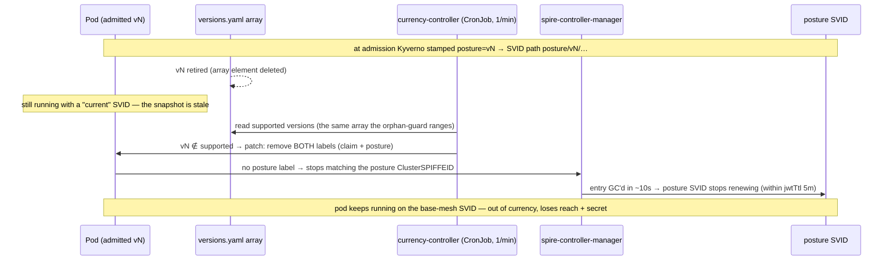

# platform/currency-controller — posture re-evaluated after admission

**Ticket 16.** Kyverno stamps posture at *admission* (ticket 15) — a frozen
snapshot. This controller makes posture **live**: when a running workload's
admitted version is retired from the platform array, a bounded reconcile pass
**re-patches** its posture (default) or **evicts** it, and the SVID follows.
This closes the single biggest gap research 16 flagged.

## The gap it closes



## Currency = still in the array

`supported` is the version set still declared in `distribution/versions.yaml`
(via the `policy-versions` ResourceSet) — the **same array** the orphan-guard
allow-lists. A pod is **stale** iff its `posture.acme.io/version` is no longer in
that set: it was admitted under a version that has since been retired. The
orphan-guard blocks *new* such pods at admission; this controller catches the
*already-running* ones. One source of truth, two enforcers.

## Why the re-patch removes BOTH labels (the crux)

`stamp-posture` (ticket 15) re-clobbers `posture := claim` on **every** UPDATE,
and `posture-trust-boundary` DENIES a posture with no claim. So there is exactly
one durable re-patch — remove the posture label **and** the policy-version claim
in a single merge patch (`null` deletes the key):

| after the patch | in scope for | effect |
|---|---|---|
| no claim | stamp-posture? **no** (scopes on the claim) | mutate can't re-add posture |
| no posture | posture-trust-boundary? **no** (scopes on posture) | update isn't denied |
| no claim | orphan-guard, require-* ? **no** (scope on the claim) | update isn't denied |
| no posture | posture ClusterSPIFFEID podSelector (`posture Exists`)? **no** | entry GC'd → **SVID drops to base-mesh** |

The pod keeps running, un-versioned and un-postured, on the plain base-mesh SVID.
Out of currency ⇒ it loses posture-gated reach and its OpenBao secret (ticket 17)
— "keep running but caged", priced into TCoR (user story 2).
`--action evict` is the blunt alternative: delete the pod; its controller
recreates it and re-admission hits the retired-version orphan-guard → DENIED.

## What's here

| Piece | File | Role |
|---|---|---|
| Controller | `currency.py` | pure-stdlib: `select_stale` + `deposture_patch` (tested) + in-cluster urllib reconcile |
| Identity + RBAC | `manifests/rbac.yaml` | the one audited grant to patch/evict pods + read the ResourceSet |
| Schedule | `manifests/cronjob.yaml` | one bounded reconcile pass / minute (no watch, nothing hangs) |
| Bring-up | `up.sh` | SA/RBAC + `currency.py` ConfigMap + CronJob onto driftwood (idempotent) |
| Verify | `verify-currency.sh` | offline proofs (always) + bounded live tail |

## Run it

```bash
estate/driftwood/scripts/up.sh          # cluster + Flux
estate/platform/identity/up.sh          # SPIRE + Istio + OpenBao (ticket 14)
estate/platform/posture/up.sh           # posture projection (ticket 15)
estate/platform/currency-controller/up.sh
estate/platform/currency-controller/verify-currency.sh
# demo: retire a version in distribution/versions.yaml, then trigger one pass:
kubectl -n currency-system create job --from=cronjob/currency-controller currency-once
```

## Calibration knobs

- **`schedule: "* * * * *"`** — the bounded re-evaluation interval. Total time to
  out-of-currency ≈ schedule + gcInterval (~10s) + jwtTtl (5m). Shorten for stage.
- **`--action deposture|evict`** — re-patch (drop to base-mesh, keep running) vs
  evict (recreate → denied on a retired version).
- **`SUPPORTED_VERSIONS`** env — overrides the ResourceSet read on demo paths
  where flux-operator isn't installed (comma-list).

## Boundaries

- Does **not** cage (heavier sidecar / limits) — that's ticket 10's graded
  envelope. Here, out-of-currency = de-postured to base-mesh.
- The reach/secret loss it *triggers* is enforced by ticket 17 (Istio
  `AuthorizationPolicy` + OpenBao `bound_claims`), not here.
- <!-- ponytail: one python impl for both test + live (urllib, no kubectl/deps); CronJob not a custom controller runtime -->
