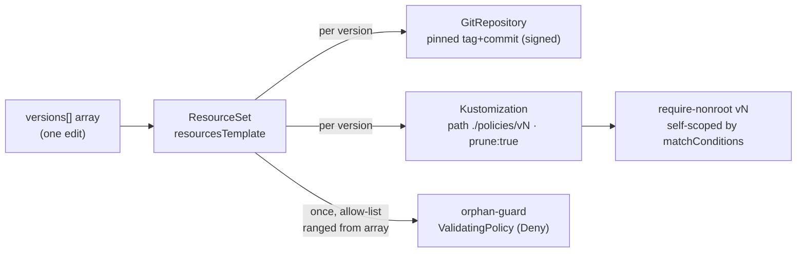

# platform / distribution — version fan-out, self-scoping, orphan-guard, prune

Flux as the load-bearing distribution plane: **one version array** installs,
coexists, and retires signed policy versions. Institutions consume this as a
pinned, signed dependency; they never author it.

## The one edit

[`versions.yaml`](versions.yaml) is a flux-operator `ResourceSet`. Its
`spec.inputs[0].versions[]` array is the whole contract:

```yaml
versions:
  - { version: "4.0.0", tag: "policy/v4.0.0", bump: "major" }  # uncut: no commit yet
```

(cs-15: no `action` field any more — nothing read it, `validationActions`
inside each policy body is the copy admission actually consults. A `commit` is
absent only while the element is an **uncut tail** — `cut-release.yml` fills it
in when it cuts the signed tag, and `release_integrity`'s empty-commit rule
refuses a *release* that still has one. A cut element after an uncut one is a
real hole and `render-orphan-guard.py --selfcheck` refuses it.)

Ranged once in `resourcesTemplate`, it fans out — and, because flux-operator
renders resources *once per input element* (with `range` only over fields
*within* an element), the array lives inside a single input's `versions` field
so one orphan-guard can see every version:



- **Install** a version → add an array element.
- **Retire** a version → delete its element. Flux `prune: true` deletes its
  Kustomization + policy, and the re-rendered orphan-guard stops allowing it.

## 2026-08-29 — three declared versions could never admit a pod

`verify-declared-versions-admit.sh` asked, for the first time, the other half of
the orphan-guard's question: of the versions the array *does* allow, which ones
can a workload actually be created under? Live on `kind-driftwood`, the answer
was **none of the released ones**:

```
FAIL 2.0.0: pods "admit-2-0-0" is forbidden: the integer value of priority (0)
  must not be provided in pod spec; priority admission controller computed -10
  from the given PriorityClass name
FAIL 2.0.1: ... same
FAIL 3.0.0: ... same
ok   4.0.0: a pod claiming it was ADMITTED
```

Every line before 4.0.0 writes `spec.priorityClassName` from a mutating webhook
and writes nothing else. The API server's built-in **Priority admission plugin**
has already stamped `spec.priority` and `spec.preemptionPolicy` by then; its
validating half re-derives both from the mutated class name and refuses the pod
when either disagrees. (The preemption half only became visible once the
priority half was fixed — the plugin reports one field at a time.) So 2.0.0,
2.0.1 and 3.0.0 were declared, allowed by the orphan guard, and could not deploy
a single workload. An adopter pinned to one of them was stuck.

**What was done, and what was not.**

- The three released trees were **not edited**. A released tree is frozen
  (`render-version-tree.py`'s header) and sits behind a signed tag; editing one
  in place would make the cluster disagree with what Flux delivers. They stay on
  disk, unchanged, and history is not rewritten.
- The three array elements were **retired** — the estate's own mechanism
  (`verify-retirement.sh`): deleting an element prunes that version's
  Kustomization and stops the orphan guard allowing it.
- Each broken line was first **patched** as a backport (`v2.0.2` from the
  released `v2.0.1` body, `v3.0.1` from `v3.0.0`), repairing the priority triple
  and nothing else. **Those backports were themselves retired the same day.**
  See below.

### The backports were retired too — the second defect

Repairing the priority triple made pods creatable under the 2.x and 3.x lines
again, and that immediately exposed the reason those lines cannot come back:

**every pre-ADR-0022 body reads the tier from the POD's own label.** Observed
live on `kind-driftwood`, in Namespace `driftwood`, which declares
`policy-as-versioned.dev/governed=true` and `posture.acme.io/tier=isolated`:

```
$ kubectl apply --dry-run=server -f pod.yaml   # claims 2.0.2, forges tier=baseline,
                                               # hostNetwork: true, hostPID: true
baseline hostNet=true pc=cage-baseline-2-0-2
$ # the identical pod, claiming 4.0.0:
isolated hostNet= pc=cage-isolated-4-0-0
```

A running pod confirmed it reached the API server from the isolated namespace: a
NetworkPolicy does not apply to a host-network pod, so the isolated rung's
no-ingress/no-egress projection was no bar at all. The pod chose its own cage,
which is precisely what ADR-0022 and NORTH-STAR §4 exist to make impossible.

This is **not fixable as a patch**. Teaching a 2.x or 3.x body to read
`namespaceObject` *is* ADR-0022, which `cage_engine` classifies **major**, and
ADR-0011 refuses a declared bump weaker than the computed one. A patch number
carrying a major change would be a lie about the version. So the honest repair
is retirement, not a number: `2.0.2` and `3.0.1` were deleted from the array,
their (never-cut, never-tagged) trees removed, and the three adopters recomposed
onto `4.0.0`.

Two further defects retired with them, both real and both observed live:

- The older bodies write `allowPrivilegeEscalation: false` without
  `privileged: false`, and the API server rejects that pair — so a pod declaring
  `privileged: true` was **refused**, which brief rule 4 forbids. 4.0.0 writes
  both.
- The legacy `cage-netpol` generates one `cage-egress-lockdown` NetworkPolicy
  selecting *every* caged pod in the namespace with no tier in its podSelector,
  with `synchronize` off and no cleanup. One pod that briefly claimed 2.0.2 left
  a namespace-wide DNS-only egress clamp behind that outlived it by 19 minutes
  and would have clamped every 4.0.0 `baseline` pod in that namespace for good.
  `graded/prune-retired.py` removes such an orphan; 4.0.0 generates per-tier.

**The array now declares `4.0.0` alone.** Consequences, all of them disclosed
rather than papered over:

- `shift-left/verify-shift-left.sh`'s Audit→Deny flip beat needs a ±1
  **neighbour** to flip onto. With one major line there is none, so that beat
  now grades **could-not-look** with that reason instead of passing on the
  technicality that `ci-check.py` refuses the retired target its fixture used to
  claim.
- `graded/verify-graded.sh`'s behavioural probes only ever exercised the newest
  declared version. With one declared version that is the whole array; if a
  second is declared, the script now says so and downgrades to could-not-look
  rather than grading a quarter of the surface.
- `distribution/verify-declared-versions-admit.sh` no longer accepts "kubectl
  printed no error" as a pass. It reads every probe pod back and asserts the
  mutation ran — `priorityClassName`, `priority`, `preemptionPolicy`, the
  `posture.acme.io/caged` label and the tier — one pod per (declared version ×
  ladder rung), and could-not-looks by name if a declared version's own
  `cage-tier` MutatingPolicy is not installed on the cluster.
- `distribution/verify-render-version-tree.sh` now asserts, offline, that every
  declared tree's cage-tier dial equals its own `priorityclasses.yaml` `value`
  and `preemptionPolicy` — the check whose absence let the original defect ship.


## Self-scoping — `matchConditions`, not `objectSelector`

Each [`policies/vN/require-nonroot.yaml`](policies) self-scopes on the
`policy-as-versioned.dev/policy-version` label via a per-policy `matchConditions`
CEL check. **Not** `matchConstraints.objectSelector` — Kyverno flattens every
objectSelector into one shared `ValidatingWebhookConfiguration`
(last-reconciled-wins), which silently breaks multi-version coexistence. With
`matchConditions`, version N judges only pods that claim N; every other pod
(including unversioned) is out of scope, so versions coexist collision-free.

## Orphan-guard — the allow-list *is* the array

A single catch-all `ValidatingPolicy` (Deny) whose allow-list is ranged from the
same array: a pod claiming a version the array doesn't declare cannot run;
unlabeled pods are out of scope. Because the list is *rendered*, the runnable set
cannot drift from the declared set. [`render-orphan-guard.py`](render-orphan-guard.py)
is the offline twin flux-operator would render live — the verify beats and the
shift-left check (ticket 12) use it so they need no live operator.

## Verify (offline, runs at the venue laptop)

```sh
./verify-coexistence.sh    # two versions admit side by side, each judges only its own
./verify-orphan-guard.sh   # a version not in the array is denied
./verify-retirement.sh     # deleting an array element denies stragglers (prune)
kyverno test tests/require-nonroot   # the full pass/fail/unversioned matrix
python3 render-orphan-guard.py --selfcheck      # allow-list == array == policies/ dirs
python3 backport-priority-pair.py --selfcheck   # a patch backport moves only the priority triple
```

One beat is **live-only**, because the fact it asks about is live:

```sh
./verify-declared-versions-admit.sh   # every DECLARED version admits a real pod
```

Each `verify-*.sh` runs an always-on **offline** proof (`kyverno` only) and an
optional **live tail** that fires only when a cluster with the policies installed
is reachable (`CTX` env, default `kind-driftwood`).

## Live bring-up — prerequisites

The offline proofs above are the demonstrable claims. To run the fan-out *live*
in an institution cluster, that cluster needs, once:

- **Kyverno** (the `ValidatingPolicy` CRDs), and
- **flux-operator** (the `ResourceSet` CRD),

both installed by `estate/platform/engine/up.sh` (ticket 11) — then the
institution applies its pin (e.g. `estate/driftwood/gitops/platform/`).
Seeding the `platform` git source for the offline tour is separate live-cluster
setup — see the parent runbook (ticket 26).
