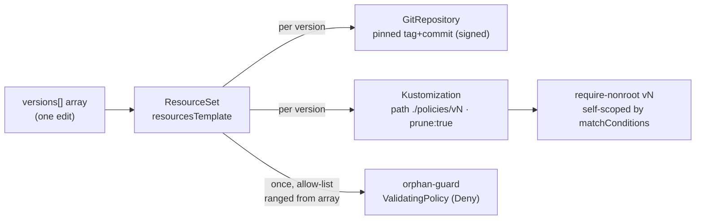

# platform / distribution — version fan-out, self-scoping, orphan-guard, prune

Flux as the load-bearing distribution plane: **one version array** installs,
coexists, and retires signed policy versions. Institutions consume this as a
pinned, signed dependency; they never author it.

## The one edit

[`versions.yaml`](versions.yaml) is a flux-operator `ResourceSet`. Its
`spec.inputs[0].versions[]` array is the whole contract:

```yaml
versions:
  - { version: "1.0.0", tag: "policy/v1.0.0", commit: "", action: "Audit" }
  - { version: "2.0.0", tag: "policy/v2.0.0", commit: "", action: "Audit" }
```

Ranged once in `resourcesTemplate`, it fans out — and, because flux-operator
renders resources *once per input element* (with `range` only over fields
*within* an element), the array lives inside a single input's `versions` field
so one orphan-guard can see every version:



- **Install** a version → add an array element.
- **Retire** a version → delete its element. Flux `prune: true` deletes its
  Kustomization + policy, and the re-rendered orphan-guard stops allowing it.

## Self-scoping — `matchConditions`, not `objectSelector`

Each [`policies/vN/require-nonroot.yaml`](policies) self-scopes on the
`policy-as-versioned.dev/policy-version` label via a per-policy `matchConditions`
CEL check. **Not** `matchConstraints.objectSelector` — Kyverno flattens every
objectSelector into one shared `ValidatingWebhookConfiguration`
(last-reconciled-wins), which silently breaks multi-version coexistence. With
`matchConditions`, version N judges only pods that claim N; every other pod
(including unversioned) is out of scope, so versions coexist collision-free.

## Orphan-guard — the allow-list *is* the array

A single catch-all `ValidatingPolicy` (Deny) whose allow-list is ranged from the
same array: a pod claiming a version the array doesn't declare cannot run;
unlabeled pods are out of scope. Because the list is *rendered*, the runnable set
cannot drift from the declared set. [`render-orphan-guard.py`](render-orphan-guard.py)
is the offline twin flux-operator would render live — the verify beats and the
shift-left check (ticket 12) use it so they need no live operator.

## Verify (offline, runs at the venue laptop)

```sh
./verify-coexistence.sh    # two versions admit side by side, each judges only its own
./verify-orphan-guard.sh   # a version not in the array is denied
./verify-retirement.sh     # deleting an array element denies stragglers (prune)
kyverno test tests/require-nonroot   # the full pass/fail/unversioned matrix
python3 render-orphan-guard.py --selfcheck   # allow-list == array == policies/ dirs
```

Each `verify-*.sh` runs an always-on **offline** proof (`kyverno` only) and an
optional **live tail** that fires only when a cluster with the policies installed
is reachable (`CTX` env, default `kind-driftwood`).

## Live bring-up — prerequisites

The offline proofs above are the demonstrable claims. To run the fan-out *live*
in an institution cluster, that cluster needs, once:

- **Kyverno** (the `ValidatingPolicy` CRDs), and
- **flux-operator** (the `ResourceSet` CRD),

then the institution applies its pin (e.g.
`estate/driftwood/gitops/platform/`). Installing those controllers + seeding the
`platform` git source for the offline tour is live-cluster setup, out of scope
for the headless build — see the parent runbook (ticket 26).
