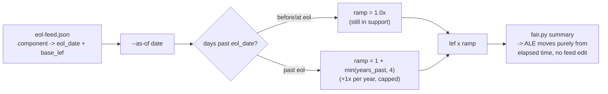

# policy-as-versioned-platform / feeds

> **Moved, 2026-08-28 (eco-system ticket 21, ADR-0019).** `threat-register`, `cve` and `eol`
> now live in the **`feeds` repo**, one envelope each (`<feed-name>/v<MAJOR>/feed.json`,
> validated by `schema.json` here), signed by that repo's gitsign tag `<feed-name>/vX.Y.Z`.
> The copies below (and `keys/`, `wardley/intel/market-intel.json`) stay in place this phase
> because their consumers still read these paths: `honesty/verify-honesty.sh`, `wargamer/`,
> `wardley/wardley.py`, the hub's `verify/provenance`, the twin's fixtures and the composer's
> `feed_file()` bridge. They are deleted, and market-intel moves, when those consumers are
> repointed (£ seam, ticket 25; twin, ticket 29). Nothing new is signed with `keys/`
> (ADR-0023 D3); `honesty/reflexive.py` now reports `verification_key_present` off the
> release.yml identity pin, not this key.
> New pins point at `{party: feeds, kind: feed, name: <feed-name>}`; `{party: platform,
> kind: threat}` is a read-only alias the composer still resolves.
>
> `schema.json` -- the feed envelope: `kind`, `name`, `version`, `published_by`,
> `published_at`, `payload_schema`, `payload`. No signature field.

**The reactive feeds** — institution threat register · CVE (trivy/GHSA-shaped) · EOL
(`endoflife.date`-shaped) — signed and versioned like the regulator feeds
(`nist` OSCAL, `ico` penalty schema), consumed by `platform/fair/fair.py` as
pinned deps. A feed change arrives as a reviewable diff (version bump) that
re-tunes the £ with **no edit to `fair.py`**. *(ticket 21)*

## What's here

```
threat-register/v1,v2/register.json(.sig)   institution -> headline threat -> lef
cve/v1,v2/cve-feed.json(.sig)               trivy/GHSA-shaped: cve -> cvss/severity/epss
eol/v1,v2/eol-feed.json(.sig)               endoflife.date-shaped: component -> eol_date + base rate
keys/feeds-signing-key(.pub).pem            shared ed25519 keypair (ponytail: repo-local demo key)
verify.sh                                   offline verify <feed> <version> <file> against the committed .sig
to_fair_scenario.py                         feed entry -> fair.py scenario (unmodified fair.py consumes it)
verify-feeds.sh                             the whole beat: verify, tamper rejection, £ moves on a
                                             bump, EOL ramps as a time-varying thread
```

Run `./verify-feeds.sh` (offline, no cluster) for the full beat.

`sign.sh` (the repo-local ed25519-via-openssl signer that produced the committed
`.sig` files above) is gone as of ticket cs-27: that ticket replaces this shape with
`cosign sign-blob` keyless for the one thing this repo now signs on an ongoing basis
(release-gate evidence, `computed-semver/evidence/`), rather than adding a second
signing mechanism alongside it. The committed feed `.sig` files here are unaffected
and still verify against `keys/feeds-signing-key.pub.pem` exactly as before --
re-signing a feed is not a live path in this codebase (each versioned feed file ships
once, signed at authoring time).

## EOL as a time-varying thread

Unlike the other feeds, EOL risk isn't priced once at ingestion — it's a function
of *when you ask*. `to_fair_scenario.py eol <feed> <component> --as-of <date>`
computes `days_past_eol` and ramps loss-event-frequency linearly (+1x per year
past `eol_date`, capped at +4x — unpatched CVEs accumulate the longer a
component goes unmaintained, `eol_ramp()` in `to_fair_scenario.py`):



So a policy version going unmaintained is priced like any other EOL risk — the
same `--as-of` clock the war-gamer (ticket 22) runs against, not a bespoke
sunset branch.

## Consumed by

`platform/fair/fair.py` (loss-event-frequency + loss-magnitude inputs, same
`(min,mode,max)` scenario shape as `estate/ico/schema/to_fair_scenario.py` and
`estate/platform/fair/scenarios/driftwood-cart-pii.json`). Institutions
(`driftwood`, `tuppence`, `ludlow`) and the war-gamer pin a feed version the
same way `driftwood/scripts/bump-nist-pin.sh` pins the `nist` catalog — a
version bump is a reviewable PR, verified offline via `verify.sh` before the
Flux/CI gate lets it in.
