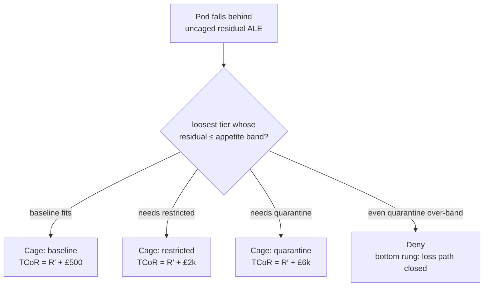
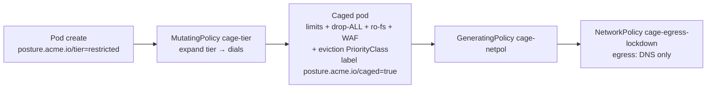

# platform/graded — the graded enforcement envelope (tiers over dials)

**Ticket 10.** Beyond admit/deny. A workload that falls behind its policy version
is **not denied** — it keeps running, **caged by degree**. Kyverno **mutate +
generate** injects the cage; the £ (`cage.py`) picks *how hard*; the cage's
run-cost is booked to **TCoR**. **Deny is only the bottom rung** — reached when
even the tightest cage leaves a residual over the org's appetite band.

## What's here

| Piece | File | Role |
|---|---|---|
| The £ engine | `cage.py` | Named tiers → dials (deterministic); the £ picks the tier; emits the TCoR ledger line (residual + cost-of-controls). Reuses `../fair/fair.py` and `../risk/enforce.py`. |
| Cage (mutate) | `policies/cage-tier.yaml` | `MutatingPolicy`: every pod is mutated into a cage — cpu/mem limits, eviction PriorityClass, and (restricted+) drop-ALL caps, read-only-fs, a WAF sidecar. A pod carrying `posture.acme.io/tier` gets that tier; one with no (or an unrecognized) tier defaults to `baseline`, the loosest tier — there is no uncaged state. Never denies. |
| Egress lockdown (generate) | `policies/cage-netpol.yaml` | `GeneratingPolicy`: a caged pod triggers a namespace `NetworkPolicy` that allows egress DNS only — the "reach" cut of the same decision. |
| Eviction priority | `policies/priorityclasses.yaml` | Three `PriorityClass`es below the default; tighter tier = evicted sooner under pressure. |
| Tests | `tests/` | `kyverno test` matrices: the cage is a **mutation** (cage present), not a deny; the generate emits the lockdown netpol. |
| Bring-up / verify | `up.sh`, `verify-graded.sh` | idempotent apply (no waits); offline proofs + bounded live tail. |

## Tiers over dials

PSS-style presets over the independent dials Kyverno injects. One table, held in
`cage.py` and mirrored by the Kyverno `dial` map (`verify-graded.sh` step 4 fails
on any drift):

| Tier | cpu / mem | drop caps | read-only fs | WAF sidecar | eviction | risk collapsed | run-cost £/yr |
|---|---|---|---|---|---|---|---|
| `baseline` | 500m / 256Mi | — | — | — | −10 | 30% | 500 |
| `restricted` | 250m / 128Mi | ALL | yes | light (100m) | −100 | 70% | 2,000 |
| `quarantine` | 100m / 64Mi | ALL | yes | heavy (250m) | −1000 | 92% | 6,000 |

## The £ picks the tier (and TCoR)

A cage is a **priced partial-reduce on a retained risk**: it collapses part of the
behind-posture residual (R′ stays > 0) at a booked run-cost (C_cage > 0). The £
picks the **loosest** cage whose residual still fits the org's appetite band
(`../risk/appetite.json`) — else **Deny**, the bottom rung.



Same behind-posture workload, different appetite → different cage. Loose-appetite
**driftwood** (£40k band) cages it `baseline`; strict-appetite **ludlow** (£5k
band) cages the *same* workload `quarantine` — proportionality, tier edition
(reusing the appetite band that drives the Audit/Deny flip in `../risk`).

```bash
cage.py select scenarios/driftwood-behind-posture.json --org driftwood   # -> baseline, TCoR ~£23.7k
cage.py select scenarios/driftwood-behind-posture.json --org ludlow       # -> quarantine, TCoR ~£8.6k
cage.py dials restricted                                                   # the deterministic dial expansion
cage.py selfcheck                                                          # the assertions
```

## The cage, at admission



The tier is set upstream by the £ / the currency controller (ticket 16) — never
self-asserted for a *loosening*: an unknown tier value falls through the map and
the mutation no-ops, and `posture.acme.io/caged` is stamped by the policy, not the
pod. Least-privilege stays the floor for everyone via the versioned `require-*`
policies; this cage only *tightens* a workload that fell behind.

## Run it

```bash
estate/driftwood/scripts/up.sh          # cluster + Flux
# Kyverno must be installed (ticket 03 / distribution path)
estate/platform/graded/up.sh
estate/platform/graded/verify-graded.sh
```

`verify-graded.sh` proves offline (no cluster) that the cage is a mutation not a
deny, the tier→dials expansion is deterministic and matches `cage.py`, an
in-currency pod (no tier label) is caged into `baseline` rather than left
untouched, the generate emits the egress lockdown, and the eviction ordering
holds. If the policies are installed live it also server-dry-runs a
behind-posture pod and asserts it is *caged* (mutated), never denied.

### Every workload is always caged (ticket 08)

There is no uncaged state. A pod with no `posture.acme.io/tier` label — the
in-currency population — is not skipped; it is mutated into `baseline`, the
loosest tier, the permissive default. `baseline` still stamps `cpu: 500m`,
`mem: 256Mi` and a `cage-baseline` PriorityClass onto every pod that previously
went untouched, so **this is itself a major bump** under `CONTEXT.md`'s own
semver rule (verdict impact on currently-compliant workloads): a pod that
cannot schedule under those new limits is refused, where before it was
admitted clean. Release this change as a major version, not a patch. A tier
value that is missing *or* unrecognized both fall through to `baseline` — never
to a no-op skip, which would be the exemption `CONTEXT.md` bans.

## Calibration knobs

- **`TIERS` reduce/cost** in `cage.py` — the risk each cage collapses and its £/yr
  run-cost. Tune to real WAF/eviction telemetry; the demo values keep the ordering
  (tighter = more reduce *and* more cost) the selection relies on.
- **PriorityClass values** (`−10 / −100 / −1000`) — how aggressively each tier is
  evicted under node pressure. All below the default 0, `preemptionPolicy: Never`.
- **WAF image** `ghcr.io/acme/coraza-waf:cage` — placeholder for the estate's
  actual heavier-WAF sidecar.

## Boundaries (what this ticket does *not* do)

- **Ticket 16** — the **currency controller** decides *when* a workload has fallen
  behind and stamps the tier label post-admission. This ticket consumes that label;
  it does not compute currency.
- **Deny path** — the versioned `require-*` ValidatingPolicies (ticket 03) and the
  risk-tuned Audit→Deny flip (`../risk`) own the admit/deny rung. `cage.py` emits a
  `Deny` action when no cage fits, but the enforcement of it is those policies.
