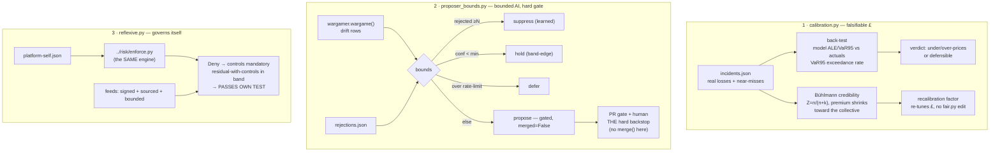

# honesty — is the £ honest *today*, and does the apparatus govern itself?

*(ticket 25; blocked-by 13 balance-sheet TCoR · 22 war-gamer)*

The layer that makes the demo survive scrutiny. Everything else prices and enforces
risk; this asks the three questions an auditor, insurer, or hostile board member
asks back:

1. **Is the number falsifiable?** — back-test the £ against real losses, recalibrate
   with credibility theory. (story 17)
2. **Can you trust your inputs and your AI?** — feeds signed/sourced/bounded; the AI
   proposer confidence/rate-limited and learning from rejections; the PR gate the
   hard backstop. (story 33)
3. **Does the apparatus hold itself to its own standard?** — the platform priced +
   governed under the *same* engine, and passing.



## What's here

```
calibration.py            back-test (model vs actuals) + Bühlmann recalibration
incidents.json            real losses + near-misses per org (driftwood hot, ludlow cold)
proposer_bounds.py        confidence + rate-limit + learn-from-rejections; gate = hard backstop
rejections.json           the war-gamer's rejection ledger (what humans keep declining)
reflexive.py              the apparatus scored by ../risk/enforce.py against its own band
scenarios/
  platform-self.json      the apparatus as a workload (controls off = warn, on = deny)
  platform-appetite.json  the apparatus's own strict band (£10k, root-of-trust)
verify-honesty.sh         the whole beat, offline
```

## 1 · Falsifiable £ (calibration.py)

The £ nobody checks is a vibe with a currency symbol. Two honest moves:

- **Back-test** — the FAIR model's warn-state ALE/VaR95 (from `../fair/fair.py`)
  held against the incident log. Count VaR95 exceedances (expected ~5%); flag
  `under-prices` / `over-prices` / `defensible`. The log is authored so driftwood
  runs **hot** (actuals above the model → recalibrate up) and ludlow **cold**
  (strict controls → actuals below → recalibrate down): an honesty layer that can
  never say "recalibrate" is theatre.
- **Recalibrate** — classic **Bühlmann credibility** over the portfolio:
  `Z = n/(n+k)`, `k = EPV/VHM`, `premium = Z·X̄ + (1−Z)·μ`. A sparse/noisy org is
  pulled toward the collective; a data-rich, distinct org keeps its own experience.
  The `premium / model_ale` ratio is the reviewable diff that re-tunes the £ —
  `fair.py` is never edited, same discipline as `enforce.py`.

```
python3 calibration.py backtest        # model vs actuals, per org
python3 calibration.py recalibrate     # Bühlmann premiums + £ factor
```

## 2 · Bounded proposer, hard gate (proposer_bounds.py)

Wraps `../wargamer` — a scary capability (it opens signed policy PRs) made safe.
Three **advisory** bounds cut reviewer noise; one **non-negotiable** backstop keeps
it safe:

| bound | what it does |
|---|---|
| confidence | a barely-over-band verdict flip (driftwood: £41,095 vs £40,000 = 2.7%) is band-edge noise → **held** for human triage, not auto-opened |
| rate-limit | at most `RATE_LIMIT` PRs auto-opened per run; the rest **defer** — one feed can't open twenty PRs |
| learn-from-rejections | a proposal declined ≥ `reject_suppress` times is **suppressed**; fewer, still proposed but carrying its history |
| **the gate (backstop)** | every surviving proposal still rides the version cross-check + human review, `merged=False`; this module exposes **no `merge()`** by construction |

The bounds decide what *reaches* a reviewer; they never decide what *merges*. The AI
is bounded for courtesy, gated for safety.

```
python3 proposer_bounds.py dispositions   # one line per drift + why
```

## 3 · Governs itself (reflexive.py)

Everything the estate does to a workload, the apparatus does to itself — scored by
the **same** `../risk/enforce.py`, not a bespoke self-scoring path. `platform-self.json`
is the apparatus as a workload: controls **off** (unsigned/unbounded feeds, an
auto-merging proposer, silent Flux drift) is the warn state; controls **on** (signed
feeds, bounded proposer, the gate) is the deny state. It **passes its own test** when
the engine returns `Deny` (its controls are mandatory under the model) *and* the
residual with controls on sits inside its own strict band. Feed-integrity —
**signed** (openssl verify + tamper-rejection), **sourced** (every entry names a
source), **bounded** (`../feeds/to_fair_scenario.py` asserts every entry yields a
valid triple) — is the concrete deny-state control.

```
python3 reflexive.py govern-self        # the apparatus's own enforcement decision
python3 reflexive.py feed-integrity     # signed / sourced / bounded report
```

## Run

```
./verify-honesty.sh        # all four beats, offline, no cluster
# or each engine's own asserts:
python3 calibration.py selfcheck
python3 proposer_bounds.py selfcheck
python3 reflexive.py selfcheck
```

## Reuse (no new engine)

`../fair/fair.py` (the £ maths) · `../risk/enforce.py` (the appetite band, turned on
the apparatus itself) · `../wargamer/wargamer.py` (the proposer being bounded) ·
`../feeds/to_fair_scenario.py` + `../feeds/verify.sh` (feed bounds + signatures). The
honesty layer adds only the credibility maths, the proposer bounds, and the reflexive
wiring.

## Not stood up here

All checks are offline (python asserts + openssl). The incident log is a curated
fixture, not a live SIEM feed; wiring `incidents.json` to a real loss ledger, and the
signed recalibration PR that a moved £ would open, are the same live-GitHub /
gitsign-Rekor step every other propose-never-dispose beat defers to a human/CI.
