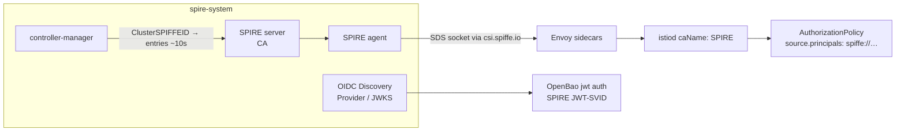

# platform/identity — the runtime-identity + secret substrate

**Ticket 14.** SPIRE + `spire-controller-manager` + Istio + OpenBao, stood up as
*inherited platform machinery* — the attestation root every institution gets
from the shared dependency, not copy-pasted per repo. This is the **substrate**;
posture rides on top of it in later tickets.

## What's here

| Piece | File | Role |
|---|---|---|
| Namespaces | `namespaces.yaml` | `spire-system`, `istio-system`, `openbao` |
| SPIRE | `spire/helmrelease.yaml` | server + agent + `spire-controller-manager` + `spiffe-csi-driver` + OIDC Discovery Provider (SPIFFE hardened charts) |
| Base identity | `spire/clusterspiffeid-mesh.yaml` | one `ClusterSPIFFEID` → every meshed pod gets `spiffe://acme.internal/ns/<ns>/sa/<sa>` |
| Istio | `istio/helmrelease.yaml` | `base` + `istiod` with `caName: SPIRE` — the mesh CA **is** SPIRE, over Envoy's SDS socket |
| STRICT mTLS | `istio/peerauthentication-strict.yaml` | mesh-wide; every accepted conn carries a SPIRE-signed SVID |
| OpenBao | `openbao/helmrelease.yaml` | dev-mode secret plane |
| Secret seam | `openbao/jwt-auth.yaml` | enables `jwt` auth against SPIRE's OIDC JWKS |
| mTLS proof | `demo-mtls/` | `ping` → `pong`; `AuthorizationPolicy` admits by SPIFFE **principal**, not IP |

## The wiring (one attestation root)



Every meshed workload's mTLS identity is a SPIFFE SVID **signed by the SPIRE CA**,
not an istiod-minted cert — so services trust the *SVID*, not network position.
OpenBao validates SPIRE **JWT-SVIDs** against the OIDC provider's JWKS (OpenBao
has no native SPIFFE auth — that's Vault Enterprise; JWT/OIDC is the trodden path).

## Boundaries (what this ticket does *not* do)

This is deliberately the plain substrate. Posture-as-identity is stacked on later:

- **Ticket 15** — Kyverno stamps a trust-bounded posture label; a *second*
  `ClusterSPIFFEID` templates `posture/vN` into the SVID path.
- **Ticket 16** — the currency controller re-evaluates posture post-admission.
- **Ticket 17** — the posture-gated Istio principal prefix + OpenBao role
  (`bound_claims` glob on the posture path).

The base `ClusterSPIFFEID` and `AuthorizationPolicy` here are the *un-postured*
forms those tickets tighten — same mechanism, narrower source.

## Run it

```bash
estate/driftwood/scripts/up.sh          # cluster + Flux must exist first
estate/platform/identity/up.sh          # applies HelmReleases, bounded reconciles
estate/platform/identity/verify-identity.sh
```

`up.sh` drives everything through Flux's helm-controller (the HelmRelease YAML is
the single source of truth), every reconcile `timeout`-bounded — a slow pull just
means "re-run", it never blocks the tour. `verify-identity.sh` asserts the
structural invariants offline (no cluster needed) and, if the substrate is up,
runs the live `ping → pong` mTLS proof.

## Calibration knobs (real-world, not constants)

- **Chart/appVersion pins** (`spire` 0.24.0, `istio` 1.24.0, `openbao` 0.16.0,
  `spire-crds` 0.5.0) — value schemas drift across minors; bump to the release
  you tour and re-run verify.
- **SVID TTLs** — `ttl: 1h` (X.509), `jwtTtl: 5m` (JWT). Short JWT bounds how
  fast an out-of-currency caller loses its OpenBao secret (ticket 17's beat).
- **Agent socket path** must match between `spire-agent.socketPath` and Istio's
  CSI mount; both dialled to `/run/spire/agent-sockets/…`.
- **OpenBao dev mode** (root token, in-memory) is demo-only — not production HA.
