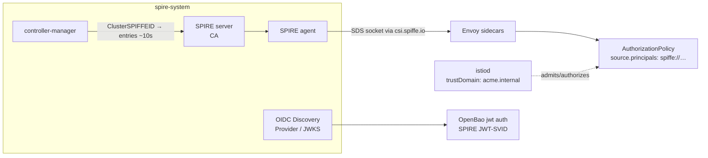

# platform/identity — the identity substrate package

**Ticket 14, repackaged by eco-system ticket 32.** SPIRE + `spire-controller-manager`
+ Istio + OpenBao + Pomerium + the two ClusterSPIFFEIDs, shipped as ONE
self-versioned `implementations` package with its own `VERSION` and its own
OSCAL control claims. An org pins the package's gitsign-signed tag and Flux
reconciles it; nothing here is meant to arrive by `kubectl apply` any more
(H8-14). This directory *is* the package: `kustomization.yaml` is its
membership, `VERSION` its version, `component-definition.json` its claims,
`flux-pin.yaml` the shape an adopting org copies into its own `gitops/`.

| Package file | What it is |
|---|---|
| `VERSION` | `1.0.0`. The number the tag `identity-substrate/vX.Y.Z` carries and the number `component-definition.json` repeats. `verify-identity.sh` asserts they agree. |
| `kustomization.yaml` | The delivered membership. Excludes `demo-mtls/` (a proof, not substrate) and `federation/` (each org applies one file, not four). |
| `component-definition.json` | The control claims. ADR-0017: the claim belongs to whoever ships the implementation, so the platform makes them once instead of every adopter re-claiming them. |
| `flux-pin.yaml` | `GitRepository` at the tag + three `Kustomization`s (`./identity`, `./posture/spire`, `./access/pomerium`). Copy into your `gitops/`, let Renovate bump the tag, merge the PR. |
| `federation/<org>.yaml` | The `ClusterFederatedTrustDomain` objects that org's cluster applies, one per peer. |

Two members sit outside this directory because kustomize refuses a resource
above its root: the posture `ClusterSPIFFEID`
(`../posture/spire/clusterspiffeid-posture.yaml`) and Pomerium
(`../access/pomerium/`, owned by `platform/access`). `flux-pin.yaml` delivers
both from the same tag, so the package still versions as one thing.

## What's here

| Piece | File | Role |
|---|---|---|
| Namespaces | `namespaces.yaml` | `spire-system`, `istio-system`, `openbao` |
| SPIRE | `spire/helmrelease.yaml` | server + agent + `spire-controller-manager` + `spiffe-csi-driver` + OIDC Discovery Provider (SPIFFE hardened charts) |
| Base identity | `spire/clusterspiffeid-mesh.yaml` | one `ClusterSPIFFEID` → every meshed pod gets `spiffe://acme.internal/ns/<ns>/sa/<sa>` |
| Istio | `istio/helmrelease.yaml` | `base` + `istiod`, `meshConfig.trustDomain: acme.internal`; sidecars pull their SVID straight from SPIRE over Envoy's SDS socket |
| STRICT mTLS | `istio/peerauthentication-strict.yaml` | mesh-wide; every accepted conn carries a SPIRE-signed SVID |
| OpenBao | `openbao/helmrelease.yaml` | dev-mode secret plane |
| Secret seam | `openbao/jwt-auth.yaml` | enables `jwt` auth against SPIRE's OIDC JWKS |
| mTLS proof | `demo-mtls/` | `ping` → `pong`; `AuthorizationPolicy` admits by SPIFFE **principal**, not IP |

## The wiring (one attestation root)



Every meshed workload's mTLS identity is a SPIFFE SVID **signed by the SPIRE CA**,
not an istiod-minted cert — so services trust the *SVID*, not network position.
OpenBao validates SPIRE **JWT-SVIDs** against the OIDC provider's JWKS (OpenBao
has no native SPIFFE auth — that's Vault Enterprise; JWT/OIDC is the trodden path).

## Trust domains and federation

One trust domain per party that **runs a cluster** — `platform`, `driftwood`,
`tuppence`, `ludlow` — each with its own SPIRE on its own cluster, federated
pairwise (ticket 12 answer 1). `nist`, `ico`, `feeds` and `insurer` run no
workloads, so they get no trust domain: they publish signed artefacts and are
consumed through a pinned tag, which needs no SVID. A shared root would be the
tenant relationship NORTH-STAR §2 forbids.

Four parties, six pairs, twelve `ClusterFederatedTrustDomain` objects — two per
pair, one on each side, in `federation/<org>.yaml`. Trust in a counterparty is
a line the party deletes from its own file; nobody revokes it for them.

**None of it is live, and `verify-federation.sh` says so and exits 3 rather
than passing.** Three separate reasons, all real:

1. driftwood's SPIRE still runs the single estate-wide trust domain
   `acme.internal`. Renaming it to `driftwood.acme.internal` re-mints every
   SVID and rewrites every file that hardcodes the old literal —
   `istio/helmrelease.yaml`'s `meshConfig.trustDomain`, the demo
   `AuthorizationPolicy` principals, `tuppence/reset/reach.py:29`,
   `tuppence/reset/openbao-role.yaml`. That is a migration, not this package.
2. tuppence and ludlow run KinD clusters with no SPIRE on them at all.
3. `spire-server.federation.enabled` is off, so this cluster serves no bundle
   endpoint either. Turning it on restarts spire-server, which re-mints the
   X.509 CA and crashloops the agent on its stale cached bundle (see `up.sh`).

### The three party-artefact fields this package still hardcodes

`trust_domain`, `bundle_endpoint` and `federates_with[]` are decided to be
signed facts on each party's own `party.yaml` (ticket 12 answer 1): federation
is a subscription, and the party artefact is the only subscription record.
`party/schema.json` does not accept them yet — it is `additionalProperties:
false` and `party_artefact.py` reads its allowed top-level keys straight out of
that file, so adding the keys today makes every party artefact REFUSED. Until
the schema takes them, `federation/*.yaml` carries the peer's trust domain and
bundle endpoint as literals, which is exactly the "demand from a literal" shape
H8-05 already names as a defect. The schema patch is small and belongs to
whoever owns `platform/party/`.

## Retiring Dex

**Owner: `platform/access`.** Nothing in this directory deletes a Dex manifest;
Dex is live on driftwood and its manifests are not this package's to remove.

Today the only human root in the estate is a Dex static bcrypt account held in
memory with no upstream connector
(`../access/oidc/dex-helmrelease.yaml:40,54-59`), and the comment beside it
narrates that account as "the SAME subject as the gitsign committer". That is
false: every signed tag in this estate is cut by a per-org **GitHub Actions
workflow** subject (`…/cut-release.yml@refs/heads/main`, issuer
`token.actions.githubusercontent.com`), pinned by regexp. No human can log in
as that subject, and no human should.

The decision (ticket 12 answer 4): five actor classes, **two issuers, distinct
subjects**. Workloads and devices attest to their org's SPIRE domain. Tags, the
proposer and the adopter's twin agent are GitHub Actions workflow OIDC
subjects. **Humans log in to Pomerium by GitHub-user OAuth — the person's own
account, the same subject GitHub records as the merger of a pull request.** Dex
is retired.

The plan, in the order it has to happen:

1. `platform/access` adds a `github` identity provider to
   `../access/pomerium/helmrelease.yaml` (`idp_provider: github`, client id and
   secret from OpenBao, not from a literal), and sets the `signingKey` that is
   currently `""`.
2. The PPL rule stops allowing one hardcoded email and starts allowing a GitHub
   org/team claim, so the allow-list is the same membership that gates merges.
3. `../access/up.sh` stops applying `oidc/dex-helmrelease.yaml`; Flux prunes
   Dex when the Kustomization that delivers `./access` no longer lists it. No
   `kubectl delete` — the deletion is a merged PR like everything else.
4. `../access/verify-access.sh` grows one assertion: no Dex Deployment is
   Running on the cluster, and Pomerium's authenticate service reports a GitHub
   provider. Until that assertion exists, the retirement is a plan, not a fact.
5. `component-definition.json` gains its `ia-8` claim — and not before. The
   Pomerium component is deliberately shipped here with an empty
   `control-implementations` for exactly that reason.

Sequencing note: step 3 removes the only working human login until step 1 and 2
land, so they merge in one PR or Dex outlives Pomerium's cutover by one release.

## Boundaries (what this ticket does *not* do)

This is deliberately the plain substrate. Posture-as-identity is stacked on later:

- **Ticket 15** — Kyverno stamps a trust-bounded posture label; a *second*
  `ClusterSPIFFEID` templates `posture/vN` into the SVID path.
- **Ticket 16** — the currency controller re-evaluates posture post-admission.
- **Ticket 17** — the posture-gated Istio principal prefix + OpenBao role
  (`bound_claims` glob on the posture path).

The base `ClusterSPIFFEID` and `AuthorizationPolicy` here are the *un-postured*
forms those tickets tighten — same mechanism, narrower source.

## Run it

```bash
estate/driftwood/scripts/up.sh          # cluster + Flux must exist first
estate/platform/identity/up.sh          # applies HelmReleases, bounded reconciles
estate/platform/identity/verify-identity.sh
```

`up.sh` drives everything through Flux's helm-controller (the HelmRelease YAML is
the single source of truth), every reconcile `timeout`-bounded — a slow pull just
means "re-run", it never blocks the tour. `verify-identity.sh` asserts the
structural invariants offline (no cluster needed) and, if the substrate is up,
runs the live `ping → pong` mTLS proof.

## Calibration knobs (real-world, not constants)

- **Chart/appVersion pins** (`spire` 0.24.0, `istio` 1.24.0, `openbao` 0.16.0,
  `spire-crds` 0.5.0) — value schemas drift across minors; bump to the release
  you tour and re-run verify.
- **SVID TTLs** — `ttl: 1h` (X.509), `jwtTtl: 5m` (JWT). Short JWT bounds how
  fast an out-of-currency caller loses its OpenBao secret (ticket 17's beat).
- **Agent socket path** must match between `spire-agent.socketPath` and Istio's
  CSI mount; both dialled to `/run/spire/agent-sockets/…`.
- **OpenBao dev mode** (root token, in-memory) is demo-only — not production HA.
