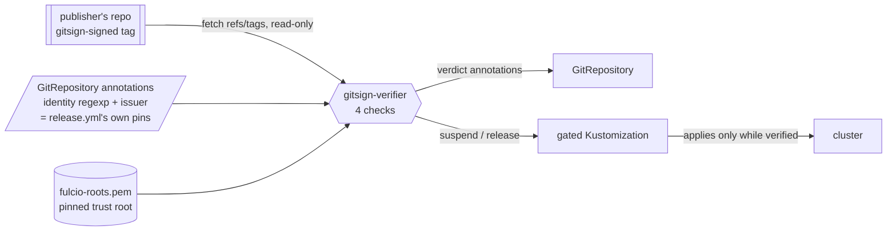

# gitsign-verifier — the identity-pinned source verifier

**Eco-system ticket 41, ADR-0023 D3, ticket 16 Q4.** A member of the identity
substrate package (`../VERSION`, `../component-definition.json`,
`../kustomization.yaml`), not a package of its own: deciding which signing
identity a cluster will accept a *policy source* from is the same question the
two ClusterSPIFFEIDs and `../federation/` answer for *workloads*.

## Why it exists

The gitsign tag is the only signature in this estate. Flux cannot verify one.
Observed live on kind-driftwood on 2026-08-28, source-controller v1.9.3
(`../../distribution/verify/PRECONDITION-h6-12.md`):

- `spec.verify: {mode: Tag}` on a real gitsign tag →
  `unsupported signature type: x509`;
- add `spec.ref.commit` → `cannot verify tag object's signature if a tag
  reference is not specified`, and the source **stalls**;
- drop `spec.verify` and keep the commit → Ready at the ancestor commit, tag
  object never fetched.

So the choice was: re-sign every tag with an SSH or OpenPGP key so Flux's
verification bites, or verify the signature that already exists. D3 took the
second. **Nothing here signs.** There is no key in this directory and
`verify-source-verification.sh` greps the program for a signing verb.

## What it does

Watches every `GitRepository` carrying two annotations, and gates whatever the
third names:

| annotation | meaning |
|---|---|
| `policy-as-versioned.dev/gitsign-identity-regexp` | who may have signed — the publisher's own `release.yml` `EXPECTED_IDENTITY_REGEXP` |
| `policy-as-versioned.dev/gitsign-issuer` | which OIDC issuer vouched — its `EXPECTED_ISSUER` |
| `policy-as-versioned.dev/gitsign-gates` | `ns/name,…` Kustomizations that must not apply from an unverified source |

Every minute it fetches `refs/tags/<spec.ref.tag>` read-only into a bare cache,
reads the tag object, and runs four checks, all of which must pass:

1. the CMS signature block verifies over the tag's own payload — the same
   bytes `git verify-tag` signs;
2. the signer certificate chains to the pinned Fulcio root
   (`fulcio-roots.pem`, `fulcio-intermediates.pem`), evaluated **at the later
   of the tagger timestamp inside the signed payload and the certificate's
   `notBefore`**, and only while `notBefore` trails the tagger time by at most
   `GITSIGN_TAGGER_SKEW_SECONDS` (declared in `deployment.yaml`, 60, with its
   reason; ticket 73, ADR-0027). A Fulcio certificate lives ten minutes, so
   "valid now" is never the question; the timestamp cannot be moved without
   breaking check 1; and git writes that timestamp *before* gitsign asks Fulcio
   for the certificate, so `notBefore` is one second later on about half of
   correctly signed tags. Chaining at the raw tagger time rejected driftwood
   and ludlow v1.1.0 on the first real lane samples. Past the bound the tag is
   rejected with a reason naming the gap and the knob; with no declaration the
   bound is 0, the strict form;
3. the certificate's URI SAN matches the pinned identity regexp;
4. the certificate's Fulcio issuer extension equals the pinned issuer.

It then writes back what it saw — `gitsign-verified`, `-verify-reason`,
`-verified-at` — and suspends or releases the gated Kustomizations. The
reason of a verified source carries the tagger time and, when the certificate
was issued later, that gap and the instant the chain was evaluated at:
`v1.1.0 signed by … at 1787677714 (certificate issued 1s later; chained at
1787677715)`. It
releases only a suspension it took itself, marked
`policy-as-versioned.dev/gitsign-suspended`, so a human's own suspend is never
overruled.



## Run it by hand

```bash
python3 verify_gitsign.py verify-object ../../distribution/verify/testdata/policy-v3.0.0.tag \
  --identity-regexp "$(sed -n 's/^  EXPECTED_IDENTITY_REGEXP: //p' ../../.github/workflows/release.yml)" \
  --issuer "$(sed -n 's/^  EXPECTED_ISSUER: //p' ../../.github/workflows/release.yml)"

python3 verify_gitsign.py verify-tag --url https://github.com/policy-as-versioned-platform/platform \
  --tag policy/v3.0.0 --identity-regexp '…' --issuer https://token.actions.githubusercontent.com
```

By hand the bound is whatever `GITSIGN_TAGGER_SKEW_SECONDS` is in your
environment, or `--tagger-skew-seconds`; unset, it is 0 and a racy tag is
rejected. `testdata/driftwood-v1.1.0.tag` is such a tag: a real signed tag from
another party whose certificate was issued one second after its tagger time,
byte-equal to `git cat-file tag v1.1.0` in
`policy-as-versioned-driftwood/driftwood` (tag object
`1a88c343345616a733b028bdad4dbc271e1a3b4f`). It is not this repo's own tag, so
`../../distribution/verify/extract-tag-fixture.sh` does not refresh it; a
re-derivation is that one `git cat-file` in a driftwood checkout.

`../../verify-source-verification.sh` is the graded form of the same thing:
section 4b reads the bound out of `deployment.yaml`, proves the racy tag at it,
proves the rejection at 0, and runs `gitsign verify-tag` on the same bytes as
a differential wherever gitsign is installed.

## The time-box, and what ends it

This controller exists **only** until Flux can do it. The removal trigger is
`fluxcd/source-controller#1068` landing — or `GitRepository.spec.verify`
growing a sigstore/x509 mode by any other route. Both look identical from a
cluster: the CRD's `spec.verify.mode` enum stops being exactly
`[HEAD, Tag, TagAndHEAD]`.

**`platform/verify-source-verification.sh` is the only thing watching.** When
that enum changes it FAILs and says: move the pins onto `spec.verify`, delete
this directory, drop the annotations, bump the identity package. Nothing else
in the estate is subscribed to #1068.

## Ceilings, named

- **No transparency-log check.** The Rekor signed entry timestamp and
  inclusion proof are not verified, so a signer who obtained a Fulcio
  certificate for the pinned identity and never logged it passes here and
  fails `gitsign verify-tag`. `verify-source-verification.sh` runs gitsign as
  a differential wherever it is installed. Closing it properly means shelling
  out to the pinned gitsign binary, which needs a built image — and this
  controller is meant to die before it earns one. The Rekor integrated time
  is also the instant check 2 would ideally chain at, the log's clock at
  upload; reading it is the transparency check itself (a signed entry
  timestamp against a pinned Rekor key), so it belongs to the identity lane
  (ticket 90), and the bounded tolerance above is what stands until then.
- **Suspend stops the next apply, not one already made.** A source that
  verified yesterday and is tampered today is caught at the next round, not at
  admission.
- **A stock image plus `apk add git openssl` at start**, so the pod needs
  egress on start and runs as root to install. Upgrade path: `cut-release.yml`
  builds and signs an image, this becomes a pinned digest, and the
  securityContext tightens.
- **`spec.ref.commit` must stay unset** on any source this verifies. With a
  commit pinned, Flux serves an artifact that need not descend from the tag at
  all, so verifying the tag would prove nothing about what got applied.
