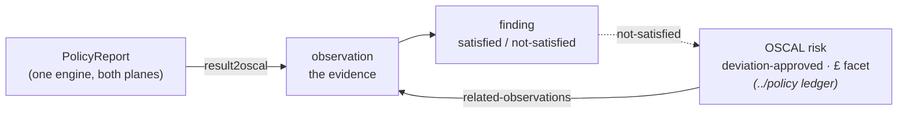

# platform / oscal — the evidence up-flow (C2P `result2oscal`)

The one Kyverno engine emits `wgpolicyk8s.io` PolicyReports for both planes.
This area is the small glue ADR-0009 says we own: it normalises those reports
into an OSCAL `assessment-results` document — **observations** (the evidence) and
**findings** (control satisfied / not-satisfied) — and, crucially, makes the chain
*resolve* into the ledger's `risk` objects (`../policy/render-exemption.py`).



## What's here

- **`component-definition.json`** — the sole policy↔control map. Each NIST
  800-53r5 control lists the `Check_Id`s (our ValidatingPolicy names) that
  evidence it. `result2oscal` string-matches `results[].policy` (version suffix
  stripped) against these. Add a control here to teach the up-flow a new policy.
- **`result2oscal.py`** — PolicyReports → assessment-results. Carries the two
  ADR-0009 shims inline (proven in `spikes/c2p-validatingpolicy-oscal`): copy
  `.scope` into each `results[].resources` (Kyverno ≥1.18 leaves it null), and
  strip the `-<version>` name suffix so one component-definition maps every
  coexisting version. Pure stdlib + PyYAML, offline, deterministic uuids.
- **`fixtures/policyreports.yaml`** — three real-shaped reports: a compliant Pod
  (pass), the `legacy-till` one-off (fail → the not-satisfied observation), and a
  Crossplane RDS (pass, to show the keying is plane-agnostic).
- **`verify-upflow.sh`** — asserts the whole chain resolves, fully offline.

## The join that makes it real

The up-flow is only evidence if the ledger's `risk.related-observations` actually
points at an observation we emit. `result2oscal` derives the observation uuid for
a ledger-covered failure from render-exemption's **own** `observation_uuid` (single
source of truth), so the pointer is byte-identical by construction — the AC-6
not-satisfied observation for `legacy-till-0` is exactly the one `EXC-2026-001`'s
priced `risk` links back to. `verify-upflow.sh` asserts that equality, not an
eyeball match.

## The £ is not here

The monetary magnitude rides on the **risk**, not the observation: it is an OSCAL
`facet` (name `annualised-loss-expectancy`) under our own `system` URI
(`https://pavf.dev/ns/risk/gbp`) — the same idiom CVSS scores use, so it is
standard OSCAL, not a fork. That facet is emitted by `../policy/render-exemption.py`
(ticket 05) and sourced from `fair.py`'s residual ALE, so the ledger row's price
and the balance sheet agree by construction (research 09).

## Run

```sh
python3 result2oscal.py --selfcheck      # runnable asserts
python3 result2oscal.py                  # print assessment-results (YAML)
./verify-upflow.sh                        # full chain, offline
```

Live tail: `verify-upflow.sh` runs an independent OSCAL schema validation via
`compliance-trestle` if the `trestle` CLI is on PATH; otherwise it skips that step.
