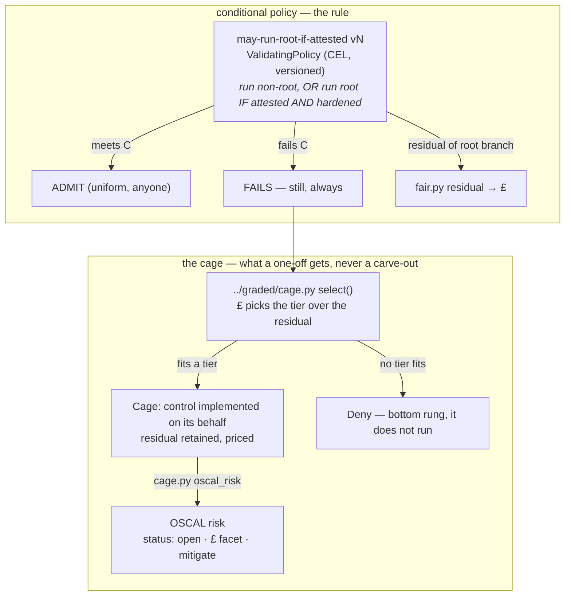

# platform / policy — conditional policy (exemptions banned, not dissolved)

Exemptions are not carve-outs here — not dissolved into some other mechanism,
banned outright, at any scope, under any name (`CONTEXT.md`). Two legitimate
mechanisms remain, in strict priority:

1. **Conditional policy** — "you may X *if* conditions C", written as one uniform
   versioned CEL rule. Anyone meeting C admits; no named team, no allow-list. This
   dissolves the *expressible* exemptions into the rule itself.
2. **The cage** (`../graded/cage.py`) — what a genuine one-off that *cannot* meet C
   gets instead. It still fails this check; a cage implements the control on its
   behalf, the £ picks how hard, and the residual is priced and retained, never
   carved out. The cage's own decision is the generator of that workload's OSCAL
   `risk` object (ticket 05 — this used to be a ledger entry rendering a
   `PolicyException`; that mechanism is deleted, not dissolved).



## The conditional rule — `policies/v1.0.0/may-run-root-if-attested.yaml`

`Audit` ValidatingPolicy, self-scoped on `policy-as-versioned.dev/policy-version`
(matchConditions, **not** objectSelector — see `../distribution/README.md`). The
validation is one line:

```
nonroot || (attested && hardened)
```

`attested` = a non-empty `policy-as-versioned.dev/root-attestation` label;
`hardened` = every container drops ALL caps and mounts a read-only root fs.
There is no team name in it — the condition C is identical for everyone, so the
old "team foo is exempt" favour becomes a rule anyone can satisfy the same way.
The root-but-hardened branch still carries residual risk; `fair.py` prices it
(`scenarios/driftwood-root-residual.json`, residual ALE ≈ £21,360/yr).

## The cage — what a one-off gets instead (ticket 05)

`legacy-till` cannot meet condition C (its firmware needs `CAP_NET_RAW`, so it
cannot drop ALL capabilities). It used to get a git ledger row rendering a
`PolicyException` — banned outright, at any scope, under any name
(`CONTEXT.md`) — and that mechanism is **deleted**, not dissolved into
something softer. It still fails `may-run-root-if-attested` today, same as
anyone else who doesn't meet C. What it gets instead is `../graded/cage.py`:
the £ picks the loosest tier whose caged residual fits the org's appetite
band (`baseline` for driftwood, TCoR ≈ £23.7k/yr), or **Deny** — the bottom
rung — if none does. Nothing is carved out; the workload is either
constrained by a cage priced into the institution's band, or it does not run.

## The generator of the OSCAL risk — `../graded/cage.py`

`cage.oscal_risk()` takes over from the deleted `render-exemption.py`: the cage
already knows the tier, the residual and the workload, so the evidence comes
from the thing actually constraining the workload, not a document asserting an
intention. Shape: `status: open` (not `deviation-approved` — the check still
fails, nothing is excepted), the **£ ALE as a facet** under
`https://pavf.dev/ns/risk/gbp` (the CVSS-style extension NIST intends),
`remediation type: mitigate`, no `deadline` (a cage isn't time-boxed —
ADR-0006), and `related-observations` back to the failing check
(`cage.observation_uuid`, the single formula `../oscal/result2oscal.py` also
uses for every observation it emits, so the join resolves by construction).
The £ is not invented — it is `fair.py`'s residual ALE for the workload's
scenario, so the cage's decision, the risk object, and the balance sheet agree.

## Verify (offline, runs at the venue laptop)

```sh
./verify-conditional.sh                 # C admits uniformly; non-C fails; residual → £
kyverno test tests/conditional          # the pass/fail/skip matrix
python3 ../graded/cage.py selfcheck     # tiers/dials, the £ picks the tier, OSCAL risk resolves
```

Each `verify-*.sh` runs an always-on **offline** proof (`kyverno` + the offline
render twin) and an optional **live tail** that fires only when a cluster is
reachable (`CTX` env, default `kind-driftwood`).

## Live bring-up — prerequisites

The offline proofs are the demonstrable claims. To run this live an institution
cluster needs, once: **Kyverno** (ValidatingPolicy CRDs) and the cage's own
mutate/generate policies (`../graded`). Installing those and seeding the git
source is live-cluster setup, out of scope for the headless build — see the
parent runbook (ticket 26).
