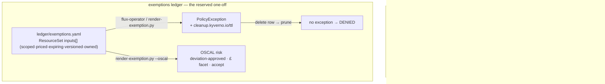

# platform / policy — conditional policy (exemptions dissolved)

Exemptions are not carve-outs here. Two mechanisms, in strict priority:

1. **Conditional policy** — "you may X *if* conditions C", written as one uniform
   versioned CEL rule. Anyone meeting C admits; no named team, no allow-list. This
   dissolves the *expressible* exemptions into the rule itself.
2. **The exemptions ledger** — reserved for a genuine one-off that *cannot* meet C.
   A git ledger row renders a `PolicyException` (Flux prune + `cleanup.kyverno.io/ttl`
   backstop) **and** is the generator of that deviation's OSCAL `risk` object.



## The conditional rule — `policies/v1.0.0/may-run-root-if-attested.yaml`

`Audit` ValidatingPolicy, self-scoped on `policy-as-versioned.dev/policy-version`
(matchConditions, **not** objectSelector — see `../distribution/README.md`). The
validation is one line:

```
nonroot || (attested && hardened)
```

`attested` = a non-empty `policy-as-versioned.dev/root-attestation` label;
`hardened` = every container drops ALL caps and mounts a read-only root fs.
There is no team name in it — the condition C is identical for everyone, so the
old "team foo is exempt" favour becomes a rule anyone can satisfy the same way.
The root-but-hardened branch still carries residual risk; `fair.py` prices it
(`scenarios/driftwood-root-residual.json`, residual ALE ≈ £21,360/yr).

## The ledger — `ledger/exemptions.yaml`

Git *is* the register, and this file *is* the flux-operator `ResourceSet` (one
file, exactly as `../distribution/versions.yaml` is both the array and its
ResourceSet). Each `spec.inputs[]` element is one genuine one-off:

```yaml
- id: "EXC-2026-001"
  policy: "may-run-root-if-attested"
  version: "1.0.0"
  namespace: "shop"
  scope: "object.metadata.?labels['app'].orValue('') == 'legacy-till'"
  owner: "platform-security"
  control: "nist-800-53:AC-6"
  expires: "2026-10-01"       # -> cleanup.kyverno.io/ttl on the rendered exception
  scenario: "driftwood-root-residual.json"   # -> the £ it carries
```

flux-operator renders **one `PolicyException` per row**. Delete a row and the
ResourceSet garbage-collects its exception (**prune**); the TTL is the belt-and-
braces backstop — the Kyverno cleanup controller deletes the exception at
`expires` even if git never prunes. **No row → no exception. Literally.**

## The generator of the OSCAL risk — `render-exemption.py`

The offline twin of the Flux render (the verify beats and the OSCAL up-flow run
without flux-operator in the loop) **and** the generator of each row's OSCAL
`risk` (research 09 shape): `status: deviation-approved`, owner as an origin
actor, likelihood/impact facets, the **£ ALE as a facet** under
`https://pavf.dev/ns/risk/gbp` (the CVSS-style extension NIST intends),
`remediation type: accept`, `deadline` = expiry, and `related-observations` back
to the failing check. The £ is not invented — it is `fair.py`'s residual ALE for
the row's scenario, so the ledger, the risk object, and the balance sheet agree.

## Verify (offline, runs at the venue laptop)

```sh
./verify-conditional.sh                 # C admits uniformly; non-C fails; residual → £
./verify-exemption.sh                   # no row→denied; row→PolicyException(+ttl); remove→prune
kyverno test tests/conditional          # the pass/fail/skip matrix
python3 render-exemption.py --selfcheck # PolicyException + OSCAL risk == ledger, deterministic
python3 render-exemption.py             # print the rendered PolicyException(s)
python3 render-exemption.py --oscal     # print the generated OSCAL risk object(s)
```

Each `verify-*.sh` runs an always-on **offline** proof (`kyverno` + the offline
render twin) and an optional **live tail** that fires only when a cluster is
reachable (`CTX` env, default `kind-driftwood`).

## Live bring-up — prerequisites

The offline proofs are the demonstrable claims. To run this live an institution
cluster needs, once: **Kyverno** (ValidatingPolicy + PolicyException CRDs, and
the **cleanup controller** for the TTL backstop) and **flux-operator** (the
`ResourceSet` CRD). Installing those and seeding the git source is live-cluster
setup, out of scope for the headless build — see the parent runbook (ticket 26).
