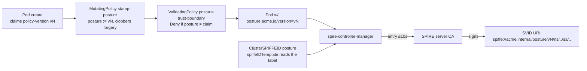

# platform/posture — Kyverno → SPIRE posture projection

**Ticket 15.** Admission posture becomes a *real attested SVID property*: Kyverno
stamps a trust-bounded posture label at admission, and a `ClusterSPIFFEID`
template bakes it into the SVID **path** (`spiffe://acme.internal/posture/vN/…`).
The label is settable **only** by the trusted Kyverno policy; forging it is
refused. This sits on top of the identity substrate (ticket 14).

## What's here

| Piece | File | Role |
|---|---|---|
| Stamp (mutate) | `policies/stamp-posture.yaml` | `MutatingPolicy`: `posture.acme.io/version` := the validated `policy-as-versioned.dev/policy-version` claim. The **only** writer; overwrites forged input. |
| Trust boundary (validate) | `policies/posture-trust-boundary.yaml` | `ValidatingPolicy` **Deny**: a posture label that ≠ the claim (or has no claim) is refused. |
| Posture SVID | `spire/clusterspiffeid-posture.yaml` | second `ClusterSPIFFEID` → `spiffe://acme.internal/posture/<vN>/ns/<ns>/sa/<sa>` |
| Tests | `tests/` | `kyverno test` matrices: stamp+clobber, and the reject/forge matrix |
| Bring-up | `up.sh` | applies the two policies + the ClusterSPIFFEID onto driftwood (idempotent, no waits) |
| Verify | `verify-posture-projection.sh` | offline proofs (always) + bounded live tail |

## The mechanism (why the SVID path, not a label or a claim)



The attested artifact the verifiers trust is the **SVID URI signed by the SPIRE
CA**, not the k8s label — the label is only the private template input. Posture
rides in the **path** (a leading segment) because SPIRE has no native per-entry
custom JWT claims (research 16 Q2 D), and a leading segment is matchable by one
Istio `principals` prefix wildcard and one OpenBao `bound_claims` glob (tickets 17).

## The trust boundary (research 16, risk #2 — get this wrong and posture is forgeable)

Two Kyverno policies + RBAC, defence in depth:

1. **Mutate overwrites** — `stamp-posture` runs in the mutating webhook (before
   validation) and sets `posture.acme.io/version` from the validated
   `policy-as-versioned.dev/policy-version` claim, **unconditionally**. A pod that
   arrives with a hand-set `posture.acme.io/version=9.9.9` gets it clobbered back
   to its real version. `operations: [CREATE, UPDATE]`, so a post-admission
   relabel is re-clobbered.
2. **Validate denies** — `posture-trust-boundary` denies any pod whose posture ≠
   its claim (or has a posture with no claim). This is what the mutate never
   produces, so it only fires on a forgery. This is the "**forging the label is
   refused**" acceptance check, provable offline.
3. **RBAC** — workload ServiceAccounts are **not** granted `patch`/`update` on
   `pods`, so a workload cannot relabel its own pod out of band. Kubernetes RBAC
   is allow-only, so this boundary is *the absence of a grant* — assert it, don't
   author a (nonexistent) deny rule. The real enforcement of an out-of-band
   relabel is the admission `UPDATE` guard in (1)+(2); RBAC removes the attempt
   surface. <!-- ponytail: RBAC = absence-of-grant + admission UPDATE guard; no theatrical unbound ClusterRole -->

## Run it

```bash
estate/driftwood/scripts/up.sh          # cluster + Flux
estate/platform/identity/up.sh          # SPIRE + Istio + OpenBao (ticket 14)
# Kyverno must be installed (ticket 03/distribution path)
estate/platform/posture/up.sh
estate/platform/posture/verify-posture-projection.sh
```

`verify-posture-projection.sh` proves offline (no cluster) that the mutate stamps
+ clobbers, the validate denies a forgery, and the ClusterSPIFFEID bakes
`posture/vN` as a leading path segment. If the policies are installed live it also
server-dry-runs a forged pod (denied) and a clobbered pod (posture reset to the
real claim).

## Boundaries (what this ticket does *not* do)

- **Ticket 16** — a **currency controller** re-evaluates posture *after* admission
  and re-patches/evicts stale pods (Kyverno only fires at admission; this is the
  snapshot→live gap). Once it flips the label, spire-controller-manager drops the
  entry in ~10s and the SVID stops renewing within one JWT TTL (5m).
- **Ticket 17** — the posture-gated **Istio `AuthorizationPolicy`** (`source.principals:
  spiffe://acme.internal/posture/vN/*`) and **OpenBao** jwt role (`bound_claims`
  glob on `/sub`). Flagship `customer-accounts-reset` (`tuppence`): a caller out
  of currency loses reach **and** its secret.

## Calibration knobs

- **`jwtTtl: 5m`** on the posture ClusterSPIFFEID — bounds how fast an
  out-of-currency caller loses its OpenBao secret once the label flips. Shorter =
  snappier revocation, more SPIRE churn.
- **Label names** — `posture.acme.io/version` (stamped) and
  `policy-as-versioned.dev/policy-version` (the claim the versioned require-*
  policies and the orphan-guard already key on). Keep both in step across the estate.
- **Trust domain** `acme.internal` — must match the identity substrate's SPIRE
  `trustDomain`.
