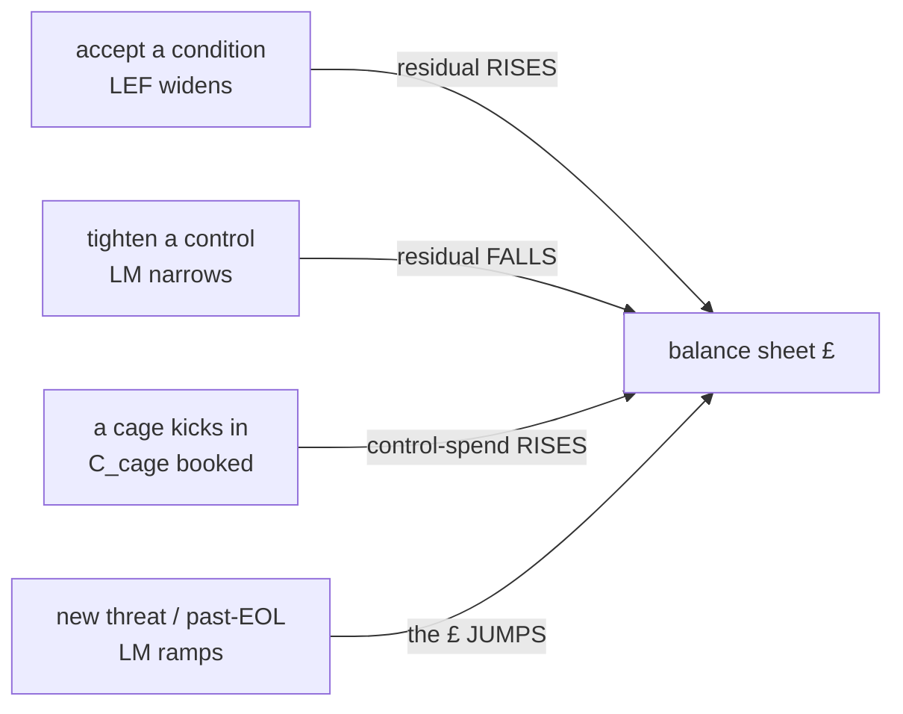

# tcor — the balance-sheet number (Total Cost of Risk) + the four-move crossover

The board line is not the mean loss and not a RAG colour. It is **Total Cost of Risk**:

```
TCoR = residual                 (£ carried after the chosen move)
     + cost-of-controls         (fix spend + dynamic-cage run-cost)
     + transfer (premiums)      (insurance ceded to a carrier)
```

For every open risk the war-gamer weighs the **four risk-financing moves** and books the
cheapest — the crossover is *computed*, not asserted as best practice:

| move       | what it does                              | TCoR decomposition                    |
|------------|-------------------------------------------|---------------------------------------|
| `fix`      | remediate to compliant; loss path closed  | `residual≈0 + C_fix`                  |
| `cage`     | retain-with-mitigation (graded envelope)  | `R'>0 + C_cage` (the £ picks the tier)|
| `transfer` | cede the exposure to a carrier            | `deductible + premium`                |
| `deny`     | bottom rung: close the path at admission  | `residual≈0 + C_deny` (lost business) |

"Compliant = cheap" is exactly where one move's TCoR curve crosses another's: `fix` beats
`deny` while `C_fix < C_deny`; `transfer` beats `fix` while a premium beats the spend; a
cheap-enough `cage` beats them all. A risk you don't run (a third-party integration) lists
`"applicable": ["transfer"]` — you can't fix, cage or deny someone else's stack.

## The living-£ loop

The number moves in the direction each lever predicts (asserted in `selfcheck`, shown by
`tcor.py levers`):



## Reuse (no new engine)

`tcor.py` adds only the transfer/premium move, the four-move crossover, and the aggregate
balance sheet. Everything load-bearing is one dir over and unchanged:

- `../fair/fair.py` — the £ maths (beta-PERT → Monte-Carlo → ALE).
- `../risk/enforce.py` — the per-org appetite band (`appetite.json`).
- `../graded/cage.py` — the cage tier + its `residual + C_cage` TCoR.

## Run

```
tcor.py sheet    scenarios/driftwood-portfolio.json --org driftwood   # the board line
tcor.py moves    <risk.json>                        --org driftwood   # the 4 moves + crossover
tcor.py levers   scenarios/driftwood-portfolio.json --org driftwood   # the £ moves per lever
tcor.py selfcheck            # runnable asserts (no cluster)
./verify-tcor.sh             # the beat, offline (needs python3)
```

Offline only — pure £ maths over versioned inputs, no cluster.
