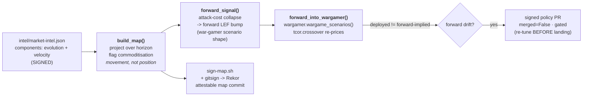

# wardley — the AI-Wardley forward layer

*(ticket 23; blocked-by 22 war-gamer)*

The **fifth, forward feed** (spec stories 28, 32). The reactive feeds (threat register ·
CVE · EOL) report what has already been seen. This layer reads the one thing they
structurally cannot: components still **moving right** on a Wardley map. When an
**attacker-capability commoditises**, its cost **collapses**, and the linked war-game
risk's loss-event-frequency rises **before a single incident lands**. That becomes a
**forward signal** the war-gamer re-prices ahead of time — so proportionality re-tunes
*before* the threat, not after.



## What's here

```
wardley.py                    the layer: map / forward-signal / wargame / selfcheck
intel/market-intel.json(.sig) SIGNED market intel — components with evolution + velocity,
                              attacker-capabilities carrying their reactive base FAIR posture
map/wardley-map.json(.sig)    the rendered, SIGNED map (attestable map-update artifact)
sign-map.sh                   render + detached-sign intel & map (attestable commit)
verify-wardley.sh             the whole beat, offline
```

## The three acceptance criteria

**1. Produces a Wardley map; flags commoditisation movement.** `build_map()` places each
component on the evolution axis (genesis / custom / product / commodity), projects it
forward by `velocity × horizon`, and flags **movement** — a component that *crosses a
stage boundary* or *reaches commodity* within the horizon. A component that is *already*
commodity and near-stationary (`credential-stuffing-aas`) does **not** flag: there is no
movement left to anticipate. This is the crucial distinction — commoditisation is read as
a *trajectory*, not a static position.

**2. Feeds a forward signal into the war-gamer.** For each commoditising
**attacker-capability**, `forward_signal()` collapses the attack cost into a forward LEF
bump on its linked risk (`factor = 1 + K × movement`) and emits a scenario library in the
*exact* shape the war-gamer already consumes. `forward_into_wargamer()` hands it straight
to `wargamer.wargame_scenarios()` unmodified. The reactive base posture is **proportionate
today** (a graded `cage`); the commoditisation bump is the *only* reason drift appears —
so the war-gamer proposes `cage → fix` **before** the campaign lands. A commoditising
*defensive* capability (`spiffe-workload-identity`) raises **no** attacker risk.

**3. Map updates are attestable commits.** `sign-map.sh` renders the map from the signed
intel and detached-signs both with the platform feeds key (offline-verifiable), and the
git commit that lands them is `gitsign`-signed (OIDC → Fulcio → Rekor) like every other
actor's. `verify-wardley.sh` proves a tampered map fails verification.

## Run it

```
python3 wardley.py map              # the map + commoditisation flags
python3 wardley.py forward-signal   # the forward scenario library
python3 wardley.py wargame          # feed it THROUGH the war-gamer
python3 wardley.py selfcheck        # the projection + seam asserts
bash    verify-wardley.sh           # the whole beat, offline
bash    sign-map.sh                 # re-render + re-sign after an intel edit
```

The `ATTACK_COST_COLLAPSE_K` knob in `wardley.py` is the one editorial calibration dial —
how hard a unit of commoditisation movement bumps frequency. It is a tuning dial, not a
physical law; widen it if a real trajectory should flip a move sooner.
