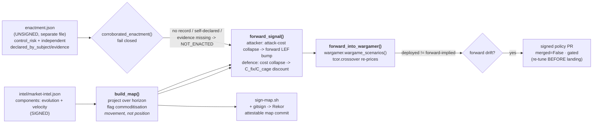

# wardley — the AI-Wardley forward layer

*(ticket 23; blocked-by 22 war-gamer)*

The **fifth, forward feed** (spec stories 28, 32). The reactive feeds (threat register ·
CVE · EOL) report what has already been seen. This layer reads the one thing they
structurally cannot: components still **moving right** on a Wardley map. When an
**attacker-capability commoditises**, its cost **collapses**, and the linked war-game
risk's loss-event-frequency rises **before a single incident lands**. When a
**defensive capability commoditises** — and its enactment is **corroborated**, not
merely asserted — the cost of the control it makes cheaper falls instead (ticket 19).
Either way it becomes a **forward signal** the war-gamer re-prices ahead of time — so
proportionality re-tunes *before* the threat, not after.



## What's here

```
wardley.py                    the layer: map / forward-signal / wargame / selfcheck
intel/market-intel.json(.sig) SIGNED market intel — components with evolution + velocity,
                              attacker-capabilities carrying their reactive base FAIR posture
enactment.json                UNSIGNED, deliberately separate from market-intel.json (ticket 19):
                              per defensive-capability, the linked control_risk a commoditised
                              defence would discount, and the independent enactment corroboration
                              (declared_by_subject / channel / evidence) gating the credit
map/wardley-map.json(.sig)    the rendered, SIGNED map (attestable map-update artifact)
sign-map.sh                   render + detached-sign intel & map (attestable commit)
verify-wardley.sh             the whole beat, offline
```

## The three acceptance criteria

**1. Produces a Wardley map; flags commoditisation movement.** `build_map()` places each
component on the evolution axis (genesis / custom / product / commodity), projects it
forward by `velocity × horizon`, and flags **movement** — a component that *crosses a
stage boundary* or *reaches commodity* within the horizon. A component that is *already*
commodity and near-stationary (`credential-stuffing-aas`) does **not** flag: there is no
movement left to anticipate. This is the crucial distinction — commoditisation is read as
a *trajectory*, not a static position.

**2. Feeds a forward signal into the war-gamer, per institution.** For each commoditising
**attacker-capability**, `forward_signal(intel, org)` collapses the attack cost into a
forward LEF bump on its linked risk (`factor = 1 + K × movement`) and emits a scenario
library in the *exact* shape the war-gamer already consumes, labelled for one of the three
risk-bearing institutions (`driftwood`, `tuppence`, `ludlow` — see `../risk/appetite.json`).
`forward_into_wargamer(intel, org)` hands it straight to `wargamer.wargame_scenarios()`
unmodified; `forward_into_wargamer_all()` runs the seam for all three. The same market
movement, judged against each institution's *own* band, does not always agree: driftwood's
loose band sees both phishing and ransomware flip `cage → fix`; ludlow's strict band already
has ransomware over-band at the reactive baseline and does not move on phishing at all — three
institutions, honestly three (here, different) drift sets, never one org standing in for the
estate.

A commoditising **defensive** capability (`spiffe-workload-identity`) never raises attacker
LEF — instead, on **corroborated enactment**, it lowers cost-of-controls
(`factor = 1 / (1 + K × movement)`, applied to `costs.fix` and the new `costs.cage_discount`
`../tcor/tcor.py` reads) for the control it makes cheaper (ticket 19). "Corroborated" means
`enactment.json` names an evidence-backed, independently-observed record
(`declared_by_subject: false`) — never the commoditisation claim in `market-intel.json`
corroborating itself. Fail closed: `pqc-transport-migration` is the same shape and carries no
`enactment.json` entry at all, on purpose (its own `market-intel.json` note explains why a
link would be dishonest), and a component missing a record, self-declared, or naming evidence
that does not resolve on disk all earn **no** credit — proven in `selfcheck()` and
`verify-wardley.sh` by planting each violation and watching the credit disappear.

**3. Map updates are attestable commits.** `sign-map.sh` renders the map from the signed
intel and detached-signs both with the platform feeds key (offline-verifiable), and the
git commit that lands them is `gitsign`-signed (OIDC → Fulcio → Rekor) like every other
actor's. `verify-wardley.sh` proves a tampered map fails verification.

## Run it

```
python3 wardley.py map                       # the map + commoditisation flags
python3 wardley.py forward-signal             # the forward scenario library, all three institutions
python3 wardley.py forward-signal --org ludlow  # ...or just one
python3 wardley.py wargame                    # feed it THROUGH the war-gamer, all three institutions
python3 wardley.py wargame --org ludlow         # ...or just one
python3 wardley.py selfcheck                  # the projection + seam asserts
bash    verify-wardley.sh                     # the whole beat, offline
bash    sign-map.sh                           # re-render + re-sign after an intel edit
```

The `ATTACK_COST_COLLAPSE_K` knob in `wardley.py` is the one editorial calibration dial —
how hard a unit of commoditisation movement bumps frequency. It is a tuning dial, not a
physical law, but it is not a free one: `cage.py`'s tier selection makes cage TCoR
non-monotone in the threat, so widening K does **not** reliably flip a move sooner — between
K=5 and K=6, `phishing-kits-aas` *stops* drifting. K=4.0 is measured to sit in a stable
plateau (3.0–5.0); see the comment on `ATTACK_COST_COLLAPSE_K` and
`.scratch/multi-org-estate/research/scenario-slate.md` §6 before touching it.
