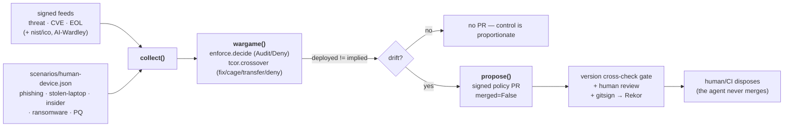

# wargamer — the governance-agent evolved into a war-gaming policy-PR proposer

*(ticket 22; blocked-by 06 risk-tuned enforcement · 13 balance-sheet TCoR · 21 signed feeds)*

The loop-closer. The old `governance-agent` (CVE → issue) evolves into a **war-gamer**:
it **collects the signed feeds**, **war-games** current controls against them — workload
*and* the human/device attack paths (phishing / stolen laptop / insider) plus the forward
ransomware/PQ class — and on **proportionality drift opens a signed policy PR**. It
**proposes, never disposes**: a human + the PR gate merge, never the agent.



## What's here

```
wargamer.py                         the agent: collect / wargame / propose / selfcheck
scenarios/human-device.json         war-game scenario library (human/device + ransomware/PQ;
                                    marked human-seed vs ai-generated; deployed_move per risk)
fixtures/threat-register/v3/        the SIGNED feed-change fixture the feed->PR seam consumes
  register.json(.sig)               (driftwood skimmer-campaign LEF uptick -> crosses the £40k band)
propose-policy-pr.sh                the "open a signed policy PR" beat (renders the diff, runs the
                                    gate, names the gitsign identity — stops before commit/push/merge)
verify-wargamer.sh                  the whole beat, offline
```

## How drift becomes a PR

The war-gamer stress-tests the **deployed** control against the **current** intelligence:

- **Enforcement controls** — `require-nonroot@2.0.0` ships `Audit`. At the baseline feed
  (threat-register v1) driftwood's cart-PII residual (`risk_bought = ALE_warn − ALE_deny`)
  sits **under** the £40k band, so Audit is proportionate. The signed v3 fixture raises
  driftwood's loss-event-frequency (a skimmer campaign); the **same unchanged control** now
  crosses the band → the £ implies **Deny** → drift → a PR flipping `validationActions:
  [Audit] → [Deny]`. An institution the feed didn't touch (ludlow) does **not** drift — no
  needless churn. This reuses `../risk/enforce.py` and `../feeds/to_fair_scenario.py`
  unchanged (feed LEF × control LM).
- **Human/device + ransomware/PQ** — each scenario is priced in the FAIR shape and run
  through `../tcor/tcor.py`'s four-move crossover (fix · cage · transfer · deny). When the
  cheapest move differs from the `deployed_move` (e.g. a stale blunt `deny` a cage/transfer
  now beats), that is drift → a PR. This is where the war-gamer wargames the human/device
  attack paths and the forward Wardley view, TCoR absorbing their loss-frequency + controls.

## Propose, never dispose (the safety property)

`propose()` returns a PR that is **opened, never merged** (`merged=False`,
`auto_merge=False`), carries the **version cross-check gate** (`../shift-left/ci-check.py`,
target ±1 window), and carries the war-gamer's **own attestable identity** (gitsign keyless
→ Fulcio → Rekor, stamped at commit time by `propose-policy-pr.sh`). The module exposes
**no `merge()`/`dispose()`** — the absence is the guarantee, asserted in `selfcheck`. The
scary capability is safe *because* it rides the existing rails: a human + the gate dispose.

## Run

```
python3 wargamer.py selfcheck      # the feed->PR seam asserts (offline, no cluster)
python3 wargamer.py wargame        # the drift report
python3 wargamer.py propose        # the signed PR proposals (never merged)
./propose-policy-pr.sh             # the beat: diff (PR body) + gate + gitsign identity
./verify-wargamer.sh               # the whole beat end to end
```

## Reuse (no new engine)

`../fair/fair.py` (£ maths) · `../risk/enforce.py` (appetite band → Audit/Deny) ·
`../tcor/tcor.py` (four-move crossover) · `../feeds/to_fair_scenario.py` (feed → scenario) ·
`../shift-left/ci-check.py` (the version cross-check gate). The war-gamer adds only the
collect → war-game → drift → propose orchestration, and the human/device scenario library.

## Not stood up here

The signed PR is rendered as a diff and stops before `git commit`/push/open/merge — the
same propose-never-merge rail as `driftwood/scripts/bump-nist-pin.sh`. Actually opening the
PR needs a live GitHub org push (and the org's Actions-create-PRs setting), and the gitsign
commit needs OIDC/Rekor network — both a human/CI step, not this offline agent.
